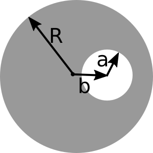

# Homework 10 (Due December 2nd)

## 1. Ampere's Law

Consider a thick SLAB of current.

The slab is infinite in (both) $x$ and $y$, but finite in $z$. So we must think about the volume current density $\mathbf{J}$, rather than $\mathbf{K}$. The slab has thickness $2h$ (It runs from $z=-h$ to $z=+h$) Let's assume that the current is still flowing in the $+x$ direction, and is uniform in the $x$ and $y$ dimensions, but now $\mathbf{J}$ depends on height linearly, i.e. $\mathbf{J} = J_0\,\mathrm{abs}(z)\,\hat{x}$, inside the slab (but is 0 above or below the slab), where $\mathrm{abs}(z)$ is the absolute value of $z$.

1. Find the B field (magnitude and direction) everywhere in space (above, below, and also, most interestingly, inside the slab!)

## 2. Quick Ampere's Law

Suppose $\mathbf{B}$ in a region of space centered on the origin has cylindrical symmetry and is given by $\mathbf{B} = B_0\hat{\phi}$ where $B_0$ is a constant, and $\hat{phi}$ is the azimuthal direction in cylindrical coordinates.

1. What is the current density in this region of space?
2. Suppose the current density that you found extends out to a radius $R$ and is zero for $r > R$.  What is the magnetic field for $r > R$?

## 3. Ampere and superposition
A clever use of superposition should can make seemingly complicated situations easier to solve.

1. A long (infinite) wire (cylindrical conductor of radius $R$, whose axis coincides with the $z$ axis) carries a uniformly distributed current $I_0$ in the $+z$ direction. A cylindrical hole is drilled out of the conductor, parallel to the $z$ axis, (see figure above for geometry). The center of the hole is at $x = b$, and the radius is $a$.  Determine the magnetic field *in the hole region.*
2. If this is an ordinary wire carrying ordinary household currents, and the drilled hole has dimensions roughly shown to scale in the figure above, make an order of magnitude estimate for the strength of the $B$ field in that region. How does it compare to the earth's field?   *You should find that the B field in the hole is uniform - that was just a little surprising to me!*

## 4. Formal manipulations and vector calculus

Griffiths (section 5.3.2) shows that, given Biot-Savart, we can arrive at Ampere's law.

1. Go through that derivation and try to recreate it/make sense of it. **Don't just copy it down - do all the steps yourself.** There are a few "gaps" in his derivation that you should be explicit about - e.g., Eq 5.50 (.52 in the 4th ed) is missing terms, what happened to them? Are you convinced of the minus sign shenanigans leading to 5.52 (.54 in 4th ed)? Convince us you understand them! Do you understand the ending: why did the contribution in Eq. 5.53 (.55 in 4th ed) "go away"?

2. Use similar mathematical gymnastics to start from the Biot-Savart law and end with $\mathbf{B} = \nabla \times \mathbf{A}$, where
$\mathbf{A}(\mathbf{r}) = \dfrac{\mu_0}{4 \pi} \int \dfrac{\mathbf{J}(\mathbf{r}')}{\mathfrak{R}}d\tau'$. (this is Griffiths Eq 5.63, or .65 in 4th edition). You’ll do this in a different way than Griffiths does (though I suggest you convince yourself you can see it his way too, which is section 5.4.1!). (Note: Part 2 is easier than part 1, really!!)
- Start with the Biot-Savart law (Eq 5.45 , or 5.47 in the 4th ed).
- Make use  of the handy identity we've seen several times this term: $\nabla \dfrac{1}{\mathfrak{R}} = \dfrac{1}{\mathfrak{R}^2}\hat{\mathfrak{R}}$  (Do you know where this relation comes from, can you show it?)  
- Then use Griffiths' product rule #7 (front flyleaf) to manipulate your expression until you get to . That “something” should be precisely the formula we’re after!  
*At some point you will need to pull the curl past an integral sign - be sure to justify why this is a perfectly legitimate thing to do.*

## 5. FIELDS AND STRENGTHS
1. Estimate the density $\rho$ of mobile charges in a piece of gold-wire speaker wire, assuming each atom contributes one free electron. (Look up any necessary physical constants!) Then, think about the definition of current, and *estimate* the average electron speed in a gold speaker wire of ordinary household size carrying an ordinary household current.  Your answer will come out quite slow - it might surprise you. If you flip on the stereo, and the speakers are, say, 2 meters away, would there be a noticeable "time lag" before you hear the speaker come on?
2. If you cut open this wire, you'll see it is really two wires, each insulated, and wrapped close together in a single plastic cylinder (since you need a complete circuit, current has to flow TO and FROM the speaker, right?). Make reasonable guesses for the dimensions involved in a real, ordinary speaker wire, to estimate the TOTAL magnetic force between the "outgoing" and "return" wires. Is it attractive or repulsive? Now - if you could somehow remove the stationary positive ions in the metallic conductor (which play no role in the flow of current, right?), make a rough estimate for the total electrical force of repulsion between the two wires. How does it compare with the magnetic force you just found?

## 6. VECTOR POTENTIAL I
1. A long (infinite) wire (cylindrical conductor, radius $R$, whose axis coincides with the $z$ axis) carries a uniformly distributed current $I_0$ in the $+z$ direction. Assuming $\nabla \cdot \mathbf{A} = 0$ (the "Coulomb gauge"), and choosing $\mathbf{A}=0$ at the edge of the wire, show that the vector potential inside the wire could be given by $A= c I_0(1-s^2/R^2)$.  Find the constant $c$ (including units.) Things to explicitly find/discuss: What is the vector direction of $\mathbf{A}$? (Does it "make sense" in any way to you?)  Is your answer unique, or is there any remaining "ambiguity" in $\mathbf{A}$? (Note that we're not asking you to derive $\mathbf{A}$ from scratch, just to see that this choice of A "works")
2. What is the vector potential outside that wire? (Make sure that it still satisfies $\nabla \cdot \mathbf{A} = 0$, and make sure that $\mathbf{A}$ is continuous at the edge of the wire, consistent with part 1).  Here again, is your answer unique, or is there any remaining "ambiguity" in $\mathbf{A}(outside)$?

## 7. VECTOR POTENTIAL II
Griffiths Fig 5.48 is a handy "triangle" summarizing the mathematical connections between $\mathbf{J}$, $\mathbf{A}$, and $\mathbf{B}$ (like Fig. 2.35) But there's a missing link, he has nothing for the left arrow from $\mathbf{B}$ to $\mathbf{A}$. Note the equations defining $\mathbf{A}$ are very analogous to the basic Maxwell's equations for $\mathbf{B}$:

$$\nabla \cdot \mathbf{B} = 0 \leftrightarrow \nabla \cdot \mathbf{A} = 0$$

$$\nabla \times \mathbf{B} = \mu_0\mathbf{J} \leftrightarrow \nabla \times \mathbf{A} = \mathbf{B}$$

1. So $\mathbf{A}$ depends on $\mathbf{B}$ in the same way (mathematically) the $\mathbf{B}$ depends on $\mathbf{J}$. (Think, Biot-Savart!) Use this idea to just write down a formula for $\mathbf{A}$ in terms of $\mathbf{B}$ to finish off that triangle.

2. In lecture notes (and/or Griffiths Ex. 5.9) we found the $\mathbf{B}$ field everywhere inside (and outside) an infinite solenoid (which you can think of as a cylinder with uniform surface current flowing azimuthally around it (see figure below). See Griff. Fig 5.35. Use the basic idea from the previous part of this question to, therefore, quickly and easily just write down the vector potential $\mathbf{A}$ in a situation where $\mathbf{B}$ looks analogous to that, i.e. $\mathbf{B} = C\delta(s-R)\hat{\phi}$, with $C$ constant. Also, sketch this $\mathbf{A}$ for us, please.  (You should be able to just "see" the answer, no nasty integral needed!)  
3. For you to discuss: What physical situation creates such a $\mathbf{B}$ field? (This is tricky - think about it!) Also, if I gave you some $\mathbf{B}$ field and asked for $\mathbf{A}$, can you now think of an "analogue method", i.e. an experiment where you could let nature do this for you, instead of computing it?
*It's cool - think about what's going on here. You have a previously solved problem, where a given $\mathbf{J}$ led us to some $\mathbf{B}$. Now we immediately know what the vector potential is in a very different physical situation, one where $\mathbf{B}$ happens to look like $\mathbf{J}$ did in that previous problem.*

