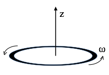

# Homework 11 (Due December 9th)

## 1. Coordinate Free Dipole Equation

In class we derived the magnetic field formula for the magnetic moment of a pure dipole which points in the z direction, located at the origin:   

$$\mathbf{B} = \dfrac{\mu_0 m}{4 \pi r^3}(2 \cos \theta\,\hat{r} + \sin \theta\,\hat{\theta})$$

Here $\mathbf{m}=I\mathbf{a}$ ($\mathbf{a}$ is the area vector of our tiny dipole) But sometimes $\mathbf{m}$ points in another direction than just $z$-hat! A more elegant way to write B which does not explicitly depend on any choice of coordinate axes is:

$$\mathbf{B} = \dfrac{\mu_0}{4 \pi r^3}(3 (\mathbf{m}\cdot\hat{r})\hat{r} - \mathbf{m})$$

1. For this problem, assume the second equation above is correct, define your $z$-axis to lie along the direction of the magnetic moment $\mathbf{m}$, and show that this leads back to first equation.   

*Coordinate free formulas are nice, because now you can find B for more general situations!*

## 2. Semi-classical electron dipole moment

A thin uniform solid torus (a "donut") has total charge $Q$, mass $M$. It rotates around its own central axis at angular frequency $\omega$, as shown.

1. Find the magnetic dipole moment $m$ of this rotating donut. What are the SI units of dipole moment?
2. Compute the ratio $m/L$, the "magnetic dipole moment" divided by the angular momentum. This is called the "gyromagnetic ratio".
3. What is the gyromagnetic ratio for a uniform spinning sphere? *HINT: This question really doesn't require any additional calculating: picture the sphere as a bunch of rings, and apply the result of part 2.*
4. In quantum mechanics, the angular momentum of a spinning electron is $\hbar/2$. Use your results above to deduce the electron's magnetic dipole moment (in SI units.)

*Note: This "semi-classical" calculation is low by a factor of almost exactly 2. Dirac developed a relativistic form of quantum mechanics which got the factor of 2 right in the 1930's. In the '40's,  Feynman, Schwinger, and Tomonaga calculated tiny extra corrections arising from QED (Quantum electrodynamics) For fun, find the current best-value for the electron magnetic dipole moment. If you compare theory and measurement, you will be extremely impressed at the agreement (~12 digits!)  It may make you "believe" in quantum physics in a way you might not have before! That's not how it works in practice though- people use this measurement to extract a fundamental constant of nature, and then use that value to predict OTHER experiments.*

## 3. Force between magnets

Toy magnets seem to have a force law which "turns on" quite suddenly as they approach, it doesn't really feel like a $1/r^2$ force. That's because it is not!

1. Consider two small magnets (treat them as point-like perfect dipoles with magnetic moments $m_1$ and $m_2$, to keep life as simple as possible). In the configuration shown above ("opposite poles facing"), find the force between them as a function of distance r.  (Does the sign work out for you sensibly?)
2. Let's do a crude estimate of the strength of the magnetic moment of a simple cheap magnet.  Assume the atomic dipole moment of an iron atom is due to an (unpaired) electron spin. Question 2 above taught us what the magnetic dipole moment of a single electron is (or, just look it up to get the factor of 2 right!) The mass density and atomic mass of iron are also easy to look up. Consider a small, ordinary, kitchen fridge "button sized" magnet, and make a very rough estimate of its total magnetic moment.
3. Use your formula from part 1 to estimate how high ($h$) one such magnet would "float" above another (if oriented as shown below). 4. Does your answer seem at all realistic, based on your experiences with small magnets? (note that such a configuration is not stable - why not? I've seen toys like this, but they have a thin wooden peg to keep the magnets vertically aligned, that's how I drew it in the figure).

## 4. Bound Currents I

Consider a long magnetic rod, radius $a$. Imagine that we have set up a permanent magnetization $\mathbf{M}(s,\phi,z) = c \hat{z}$, with $c$ = constant.  *Neglect end effects, assume the cylinder is infinitely long.*

1. Calculate the bound currents $\mathbf{K}_b$ and $\mathbf{J}_b$ (on the surface, and interior of the rod respectively).  
2. What are the units of $c$?
3. Use these bound currents to find the magnetic field inside and outside the cylinder. (Direction and magnitude)
4. Find the $\mathbf{H}$ field inside and outside the cylinder, and verify that $\oint \mathbf{H} \cdot d\mathbf{l} = I_{free}$ works. Explain briefly in words why your answer might be what it is.
6. Now relax the assumption that it is infinite - if this cylinder was finite in length ($L$), what changes? Sketch the magnetic field (inside and out). Briefly but clearly explain your reasoning.
Please draw *two* such sketches, one for the case that the length $L$ is a few times bigger than a (long-ish rod, like a magnet you might play with from a toy set),  and another for the case $L \ll a$, which is more like a magnetic disk than a rod.

## 5. Bound Currents II
Like the last question, consider a long magnetic rod, radius $a$.  This time imagine that we can set up a permanent azimuthal magnetization $\mathbf{M}(s,\phi,z) = c s \hat{\phi}$, with $c$ = constant, and $s$ is the usual cylindrical radial coordinate.  Neglect end effects, assume the cylinder is infinitely long.

1. Calculate the bound currents $\mathbf{K}_b$ and $\mathbf{J}_b$ (on the surface, and interior of the rod respectively).
2. What are the units of $c$?
3. Use these bound currents to find the magnetic field $\mathbf{B}$, and also the $\mathbf{H}$ field, inside and outside. (Direction and magnitude)

## 6. Bound Currents III
Once more, consider a very long cylinder (radius $R$) with a permanent magnetization, this time  again parallel to the axis: $\mathbf{M} = c s \hat{z}$, (where $c$ is a constant, and $s$ is the usual distance from the cylinder's axis).  There is no free current anywhere.  

1. Find the magnetic field inside and outside the cylinder by figuring out the bound current everywhere and then figure out $\mathbf{B}$ created by those.
2. Let’s find the $\mathbf{B}$ field inside and outside another way! This time, use Ampere’s law in the form: $\oint \mathbf{H} \cdot d\mathbf{l} = I_{free}$, and then use the standard relation, $\mathbf{H} = \frac{1}{\mu_0}\mathbf{B} - \mathbf{M}$, to get $\mathbf{B}$. (It should agree with part 1)
