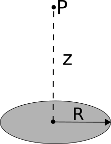

This homework is not ready until this message has been removed.

# Homework 2 (Due September 16th)

Homework 2 emphasizes the electric field and the principle of superposition that will form the basis of much of your understanding of electrostatics. This homework makes use of what you learned from Secs. 1.1-1.4 in Griffiths and adds to it the concepts from Sec. 2.1, which make up the bulk of the assignment. In addition, we have begun to introduce the idea of finding approximate formulae using Taylor expansions, which is one of the most common practices of theoretical physics. In this assignment, you will use a Jupyter notebook to explore the concept of superposition and visualize the field of a charged rod at any point in space, not just where it is more analytically tractable.

#### 1. Finding the angle between two suspended charges

When working through some physics, you will typically find yourself in a situation where a strict analytical solution to your problem evades you because the models that you have used have sophisticated algebraic forms that lead to transcendental equations, non-integrable forms, or other problematic situations. In these situations, it is often instructive to step back a moment and consider under what conditions you want to solve your problem. Those conditions might provide you with reasonable limitations and assumptions that lead to approximate forms that get you very close to what you need. In this problem, which has a familiar context from 184, we will give you the assumption to make. But in future problems, you might have to decide for yourself: *What assumptions and approximations can I make here and why?*

Two charges of identical mass $m$, one with charge $q$ and the other with charge $4q$, hang from strings of length $l$ from a common point. Assume that $q$ is sufficiently small that the electric force on each mass is quite small compared to the gravitational force on each.

1. Find an approximate expression for the angle $\theta$ that each charge makes with respect to the vertical.
2. Describe how this assumption of the relationship between the forces (i.e., that the electric force is small compared to the gravitational force) played out in your calculation, which quantities were approximated and why?
3. Check (show us!) that the units of your solution work out.
4. Show that the limiting behavior for large masses ($m$), large length ($l$), and small charge ($q$) are physically reasonable.

#### 2. Superposition rules the day

The concept of superposition is critically important to the study of electrodynamics and, for us, it will be a hugely useful in the arguments we make in electrostatics. Superposition has been called (by Danny, of course) [the crux of the biscuit](https://www.youtube.com/playlist?list=PL8WvZFiJpAr3cZlCr0Gag8BV3-mGdcUBM). For this problem, before working out the math in detail, think about how superposition helps reason through the problem.

1. Let's place 6 equal charges $q$ at the vertices of a hexagon (edge length, $l$). What is the net force on a test charge $Q$ placed at the center of the hexagon?
2. I remove one of the charges -- leaving 5 equal charges at the vertices of the hexagon. What is the net force on the test charge now? Explain your reasoning carefully.
3. Now, I place 7 equal charges $q$ at the vertices of a heptagon (edge length, $l$) and place the same test charge $Q$ at the center of the heptagon. What is the net force on that test charge?
4. I remove one of the charges -- leaving 6 equal charges at the vertices of the heptagon. What is the net force on the test charge now? Explain your reasoning carefully.
5. How is the reasoning for questions 2 and 4 similar?

#### 3. Superposition and continuous charge distributions

Superposition is a very powerful tool that can help quantitatively describe the electric field produced by any arbitrary static distribution of charges. For some problems, it is either incredibly time-consuming to apply superposition analytically to the problem or the problem may not have an analytical solution (i.e., the integral can be constructed but not solved in closed form). In this problem, you will extend your knowledge of superposition to include how we might numerically determine the electric field due to a well-known charge distribution (a rod with a constant linear charge density). *By choosing something familiar like a rod of charge, we hope for you to build intuition about the numerical method we are using.*

The electric field at a distance $r$ from the midpoint of a uniformly charged rod of length $L$ along an axis perpendicular to the rod is given by:

$$E_{rod}=\frac{1}{4\pi\varepsilon_0}\frac{Q}{r\sqrt{r^2+(L/2)^2}}$$

1. Suppose you have a vertically oriented rod of total charge $Q=+1\ \mu$C, centered at the origin with a length of 1 m. Determine the electric field at the location $\langle 0.1 , 0 , 0 \rangle$ m? *Is your answer a vector? Because it should be.*

2. To numerically compute the electric field at a point in space due to a uniformly charged rod, you must break the rod into small pieces and treat each piece as a point particle.  Then, calculate the electric field due to each piece and use superposition to get the net electric field at the given point in space.  Break each half of the rod described above into 2 pieces for a total of 4 pieces. Calculate the net electric field at the same location $\langle 0.1 , 0 , 0 \rangle$ m by treating each piece as a point charge. How does this compare with the analytic result in question 1? What can you do to make the numeric result in this exercise more accurate?

3. Note what a pain it would be if you broke the rod into 100 pieces and had to calculate electric field by hand! That's why you prefer to solve it analytically. However, not all charge distributions are easily solved analytically. Furthermore what if the point $P$ was not along an axis of symmetry? That's why we write computer programs to do the numeric calculation. We created a Jupyter notebook that walks you through how to perform this numerical integral, you can [download it here](../jupyter/HW2-ElectricFieldChargedRod.ipynb) (or [view it here](https://github.com/dannycab/phy481msu/blob/gh-pages/jupyter/HW2-ElectricFieldChargedRod.ipynb)). For this part, you are try to reproduce the value obtained in the previous part, but doing so numerically.

4. Your answer in the previous part does not match the analytic result in from the very first part because the approximation of each piece of the rod being a *point charge* at the center of the piece is not accurate for large pieces. To use smaller piece sizes, we must break the rod into a larger number of pieces, $N$. Increase $N$ and run your simulation again. What value of $N$ is sufficient to give a result that agrees within 1% of the analytic result from the first exercise? What about 0.1%? What about 0.0001% - "five sigma" agreement? What does this tell you about making *very* accurate simulations?

5. BONUS -- You now have a simulation that will solve for the electric field at any specified location, all you need to do is change the observation location. For this bonus problem, worth up to one part of one problem, alter the code (or write another code) to find the electric field in a circle of a given radius around the line charge.

#### 4. Disk of charge - Checking new results against your intuition

In this class, you will often produce new formulae that describe some situation that you might not have developed intuition for yet. So, one question you should always be asking yourself is: *How do I believe the physics/math that I've just done?!* In this problem, you will develop some techniques for checking your results against the intuition that you already hold.

Consider a thin disk of radius $R$ with a uniform charge density, $+\sigma$.

1. Find the electric field at point P, which is a distance $z$ above the center of the disk, by integrating across the surface of the disk. *Yes, we know that this field is well-known, but the practice of setting up and doing these kinds of integrals is important.* The functional form of your solution is a bit complicated and it might be tough to see how if its correct - *you can certainly look up the answer to check it, but you won't always be able to do that in this class (and in life)!* You do have some intuition about this problem from 184.
2. If you were very far from this disk, what would you expect the field to look like? Explicitly check the limiting form of your solution at very large $z$ (i.e., when $z >> R$). *By "limiting form", we mean "how it behaves as a function of distance".* So, don't just say "it goes to zero" (if that's what you think happens). Tell us how, functionally it vanishes (like $1/z$? like $e^{-z}$? Something else?).
3. If you were very close to the disk, what would expect the field too look like? Explicitly check the limiting form of your solution at very small $z$ (i.e., when $z << R$).
4. Sketch a qualitatively correct graph of the component of the electric field in the $z$-direction along the center line. Be sure to include both the positive and negative $z$-axis in your graph.

#### 5. Ring of charge - Motion of a test charge

While we spend a large amount of time working with source charges and the electric fields that they produce, we are concerned about their effect on the motion of other charges (so-called "test charges"). In this problem, you will work with the electric field due to a ring of charge to develop an approximate solution for the motion of a test charge by "linearizing" the differential equation that describes the motion. In working this problem, you will have to dust off some of your classical mechanics knowledge regarding differential equations.

Consider a thin ring (positive charge, $Q$; radius, $a$) that has its central axis directed along the $x$-direction as shown.

A charged ring with these parameters will produce an electric field along its central axis given by,

$$E_x = \dfrac{1}{4\pi\varepsilon_0}\dfrac{Qx}{\left(x^2+a^2\right)^{3/2}}$$

1. Write down the differential equation that describes the motion of a particle with negative charge $-q$ and mass $m$ that is carefully positioned on the $x$-axis. *Note: this particle has a charge that is opposite the sign of the ring, so $q$ is the magnitude of the charge of this particle.*
2. What kind of motion do you expect to see for this charge? Why? Does the differential equation describe that kind of motion? *Hint: Consider if this differential equation is analytically tractable (i.e., can it be solved in closed form).*
3. Consider the situation where the particle is very close to a large ring (i.e., where $x/a\;<<\;1$). Determine the approximate form of the differential equation for this case -- keep only terms that depend linearly on $x$. This is called "linearizing" the differential equation, which makes it analytically tractable.
4. Solve the differential equation for the case where the particle starts from rest at a distance of $x_0$ from the ring. Sketch the resulting motion of the test charge as a function of time. Does your graph agree with your intuition about the motion?
5. What would happen to the test charge if it was not placed precisely on the central axis? Why?
6. simulation

#### 6. Finding the electric field of spherical shell using direct integration

In this class, you will learn a mathematical technique (Gauss' Law) that makes solving for the electric field relatively simple in comparison to direct integration for certain kinds of problems. In this problem, you will solve for the electric field that can be determined using Gauss' Law, but you will use direct integration instead. This problem involves relatively sophisticated integral, which you are free to look up, have some software solve, or (for the gluttons for pain) solve yourself. The message here is: when you run across a difficult piece of math, it's ok to use your resources.

1. Find the electric field a distance $z$ above the center of a spherical surface of radius $R$, which carries a uniform surface charge density $\sigma$. Do this by explicit integration (i.e., starting from Griffith's equation 2.7), please. Just treat the case of $z > R$ (*outside* the sphere). Express your answer in terms of the total charge $q$ on the sphere. *Also, be careful, when you get a square root, to take the positive root:* $\sqrt{R^2 + z^2 - 2Rz}=(R-z)$ if $R>z$, but it's $(z-R)$ if $R<z$.
2. Check your answer using a units check and your knowledge from PHY 184. Briefly discuss what the answer should be outside the sphere. What should the answer be inside the sphere and why? *You don't have to solve that problem explicitly.*

*Historical note: Newton solved part 1 using geometry (no calculus!!) This geometric proof is tricky and still excites debate: see R. Weinstock Am. J. Phys., 52, (1984), p. 883; H. Erlichson, Am. J. Phys. 58, (1990) p. 882. Newton thought calculus should be kept secret, and held up publication of Principia until he could work out these non-calculus proofs. He published calculus much later, about the same time as Leibniz published his calculus.*
