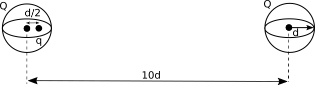

This homework is not ready until this message has been removed.

# Homework 3 (Due September 23rd)

Homework 3 emphasizes alternative methods to direct integration (Coulomb's Law) for solving the electric field problem including the use of Gauss' Law and reducing the vector problem to a scalar one by using electric potential. In addition, it introduces the concept of the Dirac delta function as a tool for describing distributions of charge. This homework makes use of what you learned in Secs. 1.5, 2.2, and 2.3 (up to about 2.3.2), but what you know from 2.1 (i.e., superposition of ($\mathbf{E}$) will also be important.

#### 1. Comparing Coulomb's Law to Gauss' Law

Now that we have, in principle, fully described how to solve any electrostatics problem (i.e., by adding up the contribution of each chunk of charge), we turn to building our theoretical toolbox by learning alternative methods that make the solving of certain kinds of problems more tractable. The first of these alternatives is Gauss' Law. It is important to know when and how to apply Gauss' Law - in the problem below, you are asked to compare Gauss' Law with Coulomb's Law.

Consider the following questions in finding the electric field everywhere for a conducting sphere, a uniformly charged sphere, and a sphere with charge distribution varying as $r^n$, all with radius $r_0$ and total charge $Q$:

1. What are the advantages and disadvantages of using Gauss' Law to find the electric field instead of using Coulomb's Law (Griffiths Eq 2.8)?  What role does symmetry play?
2. Answer the same questions for three cubes with the same properties (i.e., charge distributions that vary radially as $r^n$).
3. What do your answers to parts 1 and 2 tell you about using Gauss' Law versus using Coulomb's Law (direct integration) to solve for the electric field?

#### 2. Spherical charge distributions are special

As you might have picked up by now, spherically symmetric charge distributions are very special. We have a number of theoretical tools we can bring to bear on them and the results we produce are often quite simple in a mathematical sense. In this problem, you will explore these distributions a bit more and connect the mathematics (i.e., the integrals you must do) to the geometry of the problem (i.e., where the charge lives) to gain intuition about these spherically symmetric distributions of charge.

For parts 1 and 2, consider a sphere of radius $R$, centered one the origin, with a radially symmetric charge distribution $\rho(r)$.

1. What $\rho(r)$ is required for the electric field **in the sphere** to have the power law form $E(r) = cr^n$, where $c$ and $n$ are constants? The case of n=-2 is special. How so? Some values of $n$ are unphysical because these would lead to an infinite amount of charge in the sphere.. Which values of $n$ are allowed?
2. What kind of charge distribution is required for the radial E-field inside the sphere to be of constant magnitude; that is, what $\rho(r)$ produces $E(r) = $ constant (inside only)? Is this distribution physical realizable? Why or why not?
3. For each of these allowable charge distributions, what does the electric field look like outside the sphere ($r>R$)?
4. *The following problem is from the 2001 Physics GRE Exam. Students were expected to solve the problem in just a few minutes!* Two spherical, nonconducting, and very thin shells of uniformly distributed positive charge $Q$ and radius $d$ are located a distance 10$d$ apart. A positive point charge $q$ is placed inside on of the shells at a distance $d/2$ from the center, on the line connecting the centers of the two shells, as shown in the figure. What is the net force on the charge $q$?

#### 3. Overlapping clouds of charge

When solving some E&M problems, you will need to bring several different theoretical tools to bear. In this problem, we ask you to consider both Gauss' Law and superposition in working out your solution.

1. For a cloud of charge (radius, $R$) with uniform charge density ($\rho_0$), determine the electric field inside and outside the cloud.
2. Graph the electric field as a function of distance from the center of the cloud. [Download this Jupyter notebook](../jupyter/HW3-LinePlotting.ipynb) to create this plot (you can [view it here](https://github.com/dannycab/phy481msu/blob/gh-pages/jupyter/HW3-LinePlotting.ipynb)). *You will have to choose values for $\rho_0$ and $R$ to make your graph.*
3. Consider two oppositely charged clouds (radii, $R$), both with uniform charge densities. They overlap like shown in the figure with their centers separated by $d$. Find the electric field in the overlapping region. (*Hint: consider how Gauss' Law and superposition can help here.*)
4. In this overlapping region, sketch the electric field lines.
5. In the limit that $d$ becomes very small compared to $R$, discuss in words and make a sketch of what the resulting (total, physical) charge distribution in space really looks like (so that later in the course when we encounter such a charge distribution, we will know where it came from and what the electric field looks like inside!)

#### 4. Cube with a hole

What happens when you have problems were the symmetries are mixed? How do you tackle a problem with two different geometries? In this problem, you will explore how to deal with situations where they are two "competing" geometries for the problem.

Consider a cube (edge length $a$) with a uniform charge distributed throughout its volume ($\rho$). We carve a spherical cavity out of it of radius $d$, such that the cavity is centered at the center of the cube.

1. Does Gauss' Law hold for this problem? Can Gauss' Law be used on this problem? If so, what surface do you use? If not, why?
2. Let the center of the cube (and thus the center of the cavity) be located at the origin $\langle 0,0,0 \rangle$. Determine the electric field at point $P$ a distance $z$ from the center of the cube. Explain anything special that you had to do to determine this field.
3. Verify that your expression for the electric field makes sense if $d$ goes to zero. What does this correspond to physically?

#### 5. Describing charge distributions with delta functions

The [Dirac delta function](https://en.wikipedia.org/wiki/Dirac_delta_function) is an important theoretical tool for describing distributions of a variety of physical quantities (e.g., mass, charge) where a point object (or system of point objects) is the model we intend to use. In addition, it can be used to describe distributions where these quantities exist in highly constrained spaces (e.g., on a plane or spherical shell). In this class, we will use the Dirac delta function to describe how a charges are distributed. In this problem, you will get familiar with the Dirac delta function for a set point charges on a line.

The linear charge density for a series of charges on the $x$-axis is given by:

$$\lambda(x) = \sum_{n=0}^{10} q_0 n^2\delta\left(x-\dfrac{n}{10}\right)$$

1. Write a sentence or two describing the units of each term in the equation. (Don't forget the delta function!)
2. What is the total charge on $x$-axis?

#### 6. Using Dirac delta functions in electrostatics

Sometimes, we will describe the distribution of charge ($\rho$) using the Dirac delta function. We will need to be able to use that description to find the electric field (e.g., by using Coulomb's Law). in this problem, you will work with the Dirac delta function to describe point charge distributions with which you are familiar. You will also find the electric field due to those charge distributions. We aim for you to gain confidence in using Dirac delta functions by checking you can find the field that you determine through other means.

1. Write down the appropriate expression for the volume charge density, $\rho(\mathbf{r})$, for a point charge, $q$, located at $\mathbf{r}'$. Interpret the units of each term in the expression.
2. Consider an electric dipole with a $+q$ charge at a location $+d$ on the $y$-axis and a $-q$ charge located at $-d$ on the $y$-axis. Write down the volume charge density, $\rho(\mathbf{r})$ for this distribution.
3. Using Coulomb's law (direct integration), show that you can obtain the electric field of this dipole at any location $x$ on the $x$-axis.
4. Write down the appropriate expression for the *volume* charge distribution ($\rho$) for an infinite plane of charge at $z = a$ with surface charge density $\sigma_0$. Comment on the units of each term in your distribution.  

#### 7. Connecting potential, electric field, and charge

It is common in theoretical physics to describe the interactions of a system in terms of a scalar field (i.e., its potential). It is a compact description and you can (if you are careful) derive other important aspects of the system (e.g., how its sources are configured) from that scalar field if there is a rule for doing so. In this problem, you will do this work for a negative point charge. The understanding you draw from this problem will be used in future problems where the electric field and charge density might not be obvious.

Consider the potential of a point charge at the origin:

$$V(r) = -\dfrac{1}{4\pi\varepsilon_0}\dfrac{q}{r}$$

1. Determine the electric field of this charge by calculating the gradient ($\mathbf{E} = -\nabla V$). Show your work.
2. Calculate the charge density from the electric field by using Gauss' Law directly ($\nabla \cdot \mathbf{E} = \frac{\rho}{\varepsilon_0}$). Do this 2 ways: (1) Use the definition of the divergence from the front fly leaf of Griffiths in spherical coordinates (what do you get?) and (2) by performing a coordinate-free calculation (is your answer the same?). For (2), the following vector identities might be helpful:
$$\nabla \left(f(\mathbf{r}) \mathbf{A}\right) = \nabla f(\mathbf{r}) \cdot \mathbf{A} + f(\mathbf{r}) \nabla \cdot \mathbf{A}$$
$$\nabla \cdot \dfrac{\hat{r}}{r^2} = 4\pi\delta^3(\mathbf{r})$$
$$\nabla \cdot \dfrac{\hat{r}}{r} = \dfrac{1}{r^2}$$
3. How do your two answers from part 2 compare? Which one is correct? How do you know? What does this tell you about computing charge densities from electric potentials?

#### 8. Estimating the amount of excess charge on a balloon

Developing real world estimates of certain E&M phenomenon is an important skill to develop from this course. If what we do doesn't describe reality, what's the point?! In this problem, you will develop an estimate for that amount of electrons transferred to a balloon through "static electricity."

In class, we discussed that an electric field strength of 300 kV/m can cause the molecules in the air to breakdown allowing a spark to travel through the air. You have probably rubbed a ballon through your hair and heard some crackling - that is one effect of the breakdown of the molecules in the air as a result of this high field strength due to transferred electrons.

1. Estimate the minimum amount of static charge on a balloon that could cause this sparking. In your estimation, make clear any assumptions you are making and/or quantities that you are estimating or looking up. Explain how you are making this estimate in words.
2. Using your estimate in part 1, further estimate the fraction of excess electrons on the surface of the balloon compared to the number electrons that make up the balloon. Does this estimate seem reasonable to you? Why or why not?
