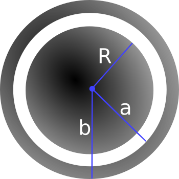
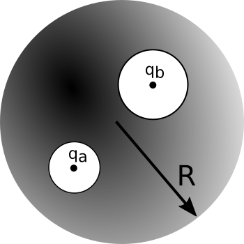

This homework is not ready until this message has been removed.

# Homework 5 (Due October 14th)

## 1. Gauss' Law and Cavities

A **metal** sphere of radius $R$, carrying a charge $q$, is surrounded by a thick concentric **metal** shell (inner radius $a$, outer radius $b$). The shell carries no net charge. Where requested, please explain your reasoning.

1. Sketch the charge distribution everywhere.
2. From part 1, you probably noticed the charge distributes in some way on the metals. Determine the surface charge density $\sigma$ at $R$, at $a$, and at $b$.
3. Find the potential everywhere, use $r \rightarrow \infty$ as your reference point for $V=0$.
4. Sketch the electric field everywhere; explain how you know the field you have drawn is correct.
5. Now the outer surface is touched by a grounding wire, which lowers its potential to zero. How do your answers change to parts 2 and 3? Explain your reasoning.

## 2. Coax capacitors

Consider a coaxial cable with an inner conducting cylinder has radius $a$ and the outer conducting cylindrical shell has inner radius $b$. It is physically easy to set up any fixed potential difference $\Delta V$ between the inner and outer conductors. In practice, the cable is always electrically neutral.

1. Assuming charge per length $+\lambda$ and $-\lambda$ on the inner and outer cylinders, derive a formula for the voltage difference $\Delta V$ between the cylinders.
2. Assuming infinitely long cylinders, find the **energy stored per length (W/L)** inside this capacitor. *Notice we are asking for the energy per unit length, the answer is not infinity!*  Let's do it two ways so we can check:
* Integrate the energy density stored in the E field . Write your answer in terms of $\Delta V$.
* Find the capacitance per length ($C/L$) of this system, and then use stored energy $W = \frac{1}{2} C (\Delta V)^2$.
3. Based on your answers to part 2, where in space would you say this energy is physically stored?
4. Estimate the capacitance per meter of the coaxial cable that the cable company uses to send TV signals into homes. Justify any assumptions.
5. This model is also excellent for "axons", which are long cylindrical cells (basically coax cables) carrying nerve impulses in your body and brain.  Estimate the capacitance (in SI metric units, Farads) of your sciatic nerve. *Assumptions - the sciatic nerve is the longest in your body, it has a diameter of roughly 1 micron, and a length of perhaps 1 m. Note that axons generally have a value of b which is very close to a (i.e. the gap is extremely tiny, b-a is about 1 nanometer. ) so you can simplify your expression using ln(1+\epsilon)\approx\epsilon.*

## 3. What is a farad?

1. The farad is actually an enormous unit of capacitance. To illustrate this, treat the Earth as a conducting sphere and find its capacitance.
2. Look up the capacitance of typical capacitors used in electronic applications. If these capacitors were conducting spheres, roughly how large would they be physically? Does this size seem to be the right size given your experience with electronic components?

## 4. Superposition in conductors ("shielding")

We carve out two spherical cavities from a metal sphere of radius $R$ (as shown below). The first cavity (radius, $a$) has a charge $q_a$ placed at the center of the cavity. Similarly, the second cavity (radius, $b$) has a charge $q_b$ placed at the center of that cavity.

1. Sketch the surface charge everywhere. Explain how you know the surface charge looks this way.
2. Determine the surface charges ($\sigma_a$, $\sigma_b$, and $\sigma_R$).
3. Sketch the electric field everywhere. Explain how you know the electric field looks this way.
4. Determine the electric field outside the conductor and inside each cavity.
5. If we brought an external charge $q_c$ near the conducting sphere how do your answers to parts 1-4 change? You may answer in words, pictures or both.

## 5. Proving Uniqueness

For this homework problem, you will prove the "second uniqueness theorem" yourself, using a slightly different method than what Griffiths does (though you may find some common "pieces" are involved!) It will really help to review/read the section on the second uniqueness theorem as you work through this problem.

**Do it like this:**

* Green's Identity is true for ANY choice of T and U, so let the functions T and U in that identity both be the SAME function.

$$\int_V \left(T \nabla^2 U + \nabla T \cdot \nabla U\right) d\tau = \oint_S \left(T \nabla U\right)\cdot d\mathbf{A}$$

* Specifically, you should set them both equal to $V_3=V_1-V_2$ where $V_1$ and $V_2$ represent different solutions to the same boundary value problem ($\nabla^2 V = 0$ with boundary conditions).
* Then, using Green's Identity (along with some arguments about what happens at the boundaries, rather like Griffith's uses in his proof) should let you quickly show that $E_3$, which is defined to be the negative gradient of $V_3$ (as usual), must vanish everywhere throughout the volume.  QED.

*Work to understand the game. We are checking if there are two different potential functions, $V_1$ and $V_2$, each of which satisfies Laplace's equation throughout the region we're considering. You construct (define) $V_3$ to be the difference of these, and you prove that $V_3$ (or in this case, $\mathbf{E}_3$) must vanish everywhere in the region. This means there really is only one unique E-field throughout the region after all!  This is another one of those "formal manipulation" problems, giving you a chance to practice with the divergence theorem and think about boundary conditions.*
