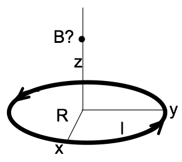
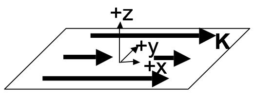

# Homework 9 (Due November 18th)

## 1. Modeling the motion of a charged particle in a magnetic field

We have shown that the motion of a charged particle in a constant magnetic is a circular when the initial velocity is perpendicular to the field. In this problem, you will complete the code in a Jupyter notebook, which you should [download](../jupyter/HW9-MotionOfChargeInMagneticField.ipynb) (you can [view it here](https://github.com/dannycab/phy481msu/blob/gh-pages/jupyter/HW9-MotionOfChargeInMagneticField.ipynb)), to model the motion of a proton in a magnetic field.

1. You first task is to read through the code and complete the integration loop to compute the trajectory of the proton and plot it in 3D. (You might need to look up how to construct a 3D plot.) For this first case, you should expect a simple circular orbit because the proton starts it's motion moving perpendicular to the magnetic field.
2. Once you have your code working for part 1, change it to give the proton a component of velocity along the direction of the magnetic field. What does the resulting motion look like? Explain qualitatively why it should look like that.
3. Now add an antiproton to your code and model it's motion along side the proton (assume the charges don't interact with each other). How does the motion of the antiproton compare to the proton? Explain qualitatively why it should look like that.

## 2. Current Density Practice

Let's practice writing down some current densities:

1. A sphere (radius $R$, total charge $Q$ uniformly distributed throughout the volume) is spinning at angular velocity $\omega \hat{z}$ about its center, which is at the origin. What is the volume current density $\mathbf{J}(r, \theta, \phi)$ at any point $(r, \theta, \phi)$ in the sphere? (Don’t forget direction too!)
2. A very thin plastic ring (radius $R$) has a constant linear charge density, and total charge $Q$. The ring spins at angular velocity $\omega$ about its center, which is the origin. What is the current $I$, in terms of given quantities? What is the volume current density $\mathbf{J}$ in cylindrical coordinates? (This may be a little tricky, since the ring is "very thin", there will be some $\delta$ functions. *Hint: write down a formula for $\rho(r,\theta,z)$ first. And, remember that $\mathbf{J}$ should be a vector!)*

## 3. Magnetic field of distributed currents

1. Compute the magnetic field $\mathbf{B}(0,0,z)$ along the $z$-axis for a current loop (current $I$, radius $R$, sitting in $x-y$ plane, centered around the $z$-axis). It is shown in the figure above.
2. Last week we had a DVD (radius $R$) with a fixed, constant, uniform surface electric charge density $\sigma$ everywhere on its top surface (figure below). It was spinning at angular velocity $\omega$ about its center (the origin).  You found the current density $\mathbf{K}$ at a distance $r$ from the center. Use that result to find the magnetic field $\mathbf{B}(0,0,z)$ at any distance $z$ directly above the origin.  (Part 1 above might help.)
3. Does your answer to part 2 seem reasonable? Please check it, with units, and some limiting behaviors (e.g. what do you expect if $R \rightarrow 0$? $\omega \rightarrow 0$?  $z\rightarrow \infty$? For this last one, don't just say "it goes to zero. This is a dipole, so $B$ should go to 0 like $1/z^3$. (Right?) Show that it does!

## 4. Magnetic field of a bent wire

An infinitely long wire has been bent into a right angle turn, as shown.  The "curvy part" where it bends is a perfect quarter circle, radius $R$.  Point P is exactly at the center of that quarter circle. A steady current $I$ flows through this wire.  

1. Find $\mathbf{B}$ at point P (magnitude and direction) (*No need to derive any formulas “from scratch” if you can get them from Griffiths’ examples!*)

## 5. Estimating the magnetic field of a square loop

1. Find $\mathbf{B}$ at the exact center of a square current loop (current $I$ running around a wire bent in the shape of a square of side $a$) (*No need to derive any formulas “from scratch” if you can get them from Griffiths’ examples!*)
2. If we had such a loop in the lab and wanted $\mathbf{B}$ at the center, we might do the above calculation, but if we were planning an experiment and just wanted a rough estimate of the magnetic field, we might "assume a spherical cow": assume the square was really a circle. We've done that problem ($\mathbf{B}$ at the center of a circular loop). It's much simpler than the square! You don't have to rederive it, but think back to how we got that result, and why it turned out to be a relatively easy application of Biot-Savart. But what radius circle would you use, to estimate $\mathbf{B}$?  You might consider finding $\mathbf{B}$ for the "inscribed" and "circumscribed" circles and then average. How good an approximation does that turn out to be? (Can you think of a better way?)

## 6. Ampere's Law - themes and variations
Consider a thin sheet with uniform surface current density.

1. Use the Biot-Savart law to find $\mathbf{B}(x,y,z)$ both above and below the sheet, by integration.
Note: The integral is slightly nasty. Before you turn to WolframAlpha - simplify as much as possible! Set up the integral, be explicit about what curly $R$ is, what $da'$ is, etc, what your integration limits are, etc. Then, make clear mathematical and/or physical arguments based on symmetry to convince yourself of the direction of the B field (both above and below the sheet), and to argue how $\mathbf{B}(x,y,z)$ depends (or doesn't) on $x$ and $y$. (If you know it doesn't depend on x or y, you could e.g. choose x=y=0 to simplify... But first you must convince us that's legit!)
2. Now solve the above problem using Ampere's law. (Much easier than part 1, isn't it?) Please be explicit about what Amperian loop(s) you are drawing and why. What assumptions (or results from part 1) are you making/using? (*Griffiths solves this problem, so don't just copy him, work it out for yourself!*)
3. Now let's add a second parallel sheet at $z=+a$ with a current running the other way. (Formally, this means $\mathbf{J}=-K_0\delta(z-a)\hat{x}$. Do you understand this notation?) Use the superposition principle (do NOT start from scratch or use Ampere's law again, this part should be relatively quick) to find B between the two sheets, and also *outside* (above or below) both sheets. *Does this remind you of a familiar electrostatics problem at all? How?*
4. Griffiths derives a formula for the B field from a solenoid (Example 5.9) Rewrite his answer (which is in terms of I) so it is expressed in terms of K (See his Fig 5.34 and 5.35 for help with this). Briefly compare with part 3, do you see any rough connections?
