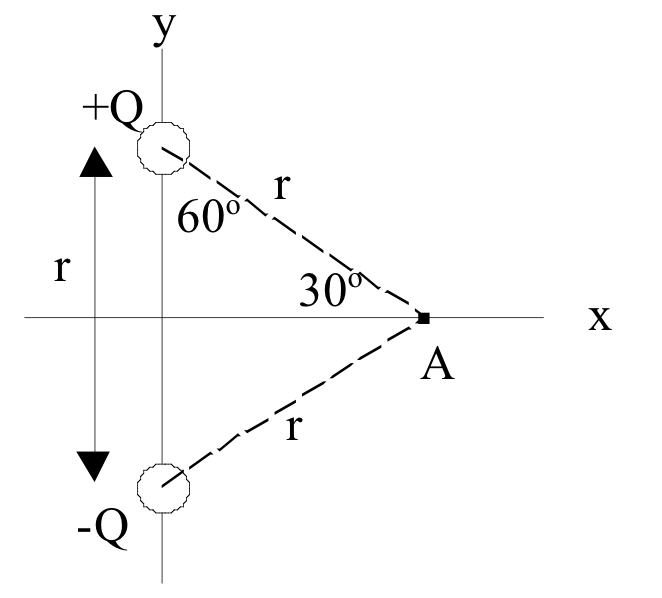

<section data-markdown>
## Welcome to PHY 481

### Electrostatics

Prof. Danny Caballero
</section>

<section data-markdown>
### Contacting Danny

Email: caballero@pa.msu.edu

Cell phone: 517-420-5330 (texting is fine)
</section>

<section data-markdown>
### Course Webpage
[dannycab.github.io/phy481msu/](http://dannycab.github.io/phy481msu/)
</section>

<section data-markdown>
### Course Activities
* Exams (2 of them; October 5 & November 2) - 20% each
* Final Exam (Time and Location: TBD) - 20%
* Homework (Lots of it; Due on Fridays) - 40%
* Clickers - Extra Credit - reduce impact of exams

Much more detail on website

</section>

<section data-markdown>

### Homework Help Session

**Evening session twice per week (Location TBD)**

Question to you: When should we do this?

1. Monday 6pm-7pm+
2. Tuesday 6pm-7pm+
3. Wednesday 6pm-7pm+
4. Thursday 6pm-7pm+

Reminder: Homework is due on Fridays.

*More details of format online*

</section>

<section data-markdown>

How likely are you to attend the help sessions?

1. Very likely; I'll attend one or both.
2. Likely, but only if the “+” extends past 7
3. Not likely, I really want a different day/time
4. I’m unlikely to attend regardless of schedule

</section>

<section data-markdown>

## This Week!!!

* Homework 1 is already up (Due Sept. 9)
* Read (seriously do this!) Griffiths Ch 1.1-1.4 & 2.1-2.2 [1]
* Download Anaconda distribution of Python

**Stay up-to-date by checking website and calendar regularly.**

[1]: *I am assuming that Ch. 1 of Griffiths is mostly review.*

</section>

<section data-markdown>

Thinking of what you want to get out of your college education and this course, which of the following is *most* important to you?

1. Acquiring information (facts, principles, concepts, procedures)
2. Learning how to use information and knowledge in new situations
3. Developing lifelong learning skills

</section>

<section data-markdown>

All three of these goals are clearly important. However,  which of these three goals do you think you can do on our own (say, before class)?

1. Acquiring information (facts, principles, concepts, procedures)
2. Learning how to use information and knowledge in new situations
3. Developing lifelong learning skills

</section>

<section data-markdown>

# Questions?

</section>

<section data-markdown>

### Electromagnetism is the foundational field theory of physics

Think about everything you already know about electromagnetism (it's a lot already!).

Work with a partner to map out the electromagnetism concepts that you know and how they are related to each other.

</section>

<section data-markdown>

## Mathematical Preliminaries

</section>

<section data-markdown>

Two charges +Q and -Q are fixed a distance r apart.  The direction of the force on a test charge -q at  A is...

1. Up
2. Down
3. Left
4. Right
5. Some other direction, or $F = 0$

Note:
* CORRECT ANSWER:  A
* Student Responses: [[92]] 4 0 2 2 (Sp 2013)
* SJP Comment: The first concept test, it went quickly, and when they did it silently it was about 70% correct. I used this to point out that even elementary questions are easy to mess up, and conversing with neighbors “fixes” simple problems. We can’t move in if 1/3 of the class is getting THIS wrong! Mentioned to some individuals that E is down, which was a nice reminder for them.

</section>
