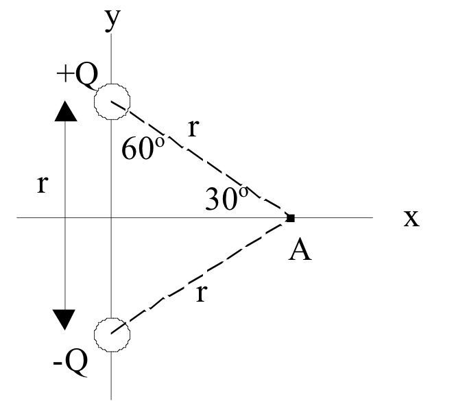

<section data-markdown>

## Lecture 2: Mathematical Preliminaries

$\nabla\cdot\mathbf{E} = \frac{\rho}{\epsilon_0}$

$\nabla\cdot\mathbf{B} = 0$

$\nabla\times\mathbf{E} = - \frac{\partial\mathbf{B}}{\partial t}$

$\nabla\times\mathbf{B} = \mu_0\mathbf{J} + \mu_0\epsilon_0\frac{\partial\mathbf{E}}{\partial t}$

</section>

<section data-markdown>

Two charges +Q and -Q are fixed a distance r apart.  The direction of the force on a test charge -q at  A is...

1. Up
2. Down
3. Left
4. Right
5. Some other direction, or $F = 0$

Note:
* CORRECT ANSWER:  A
* Student Responses: [[92]] 4 0 2 2 (Sp 2013)
* SJP Comment: The first concept test, it went quickly, and when they did it silently it was about 70% correct. I used this to point out that even elementary questions are easy to mess up, and conversing with neighbors “fixes” simple problems. We can’t move in if 1/3 of the class is getting THIS wrong! Mentioned to some individuals that E is down, which was a nice reminder for them.

</section>
