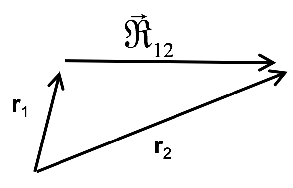
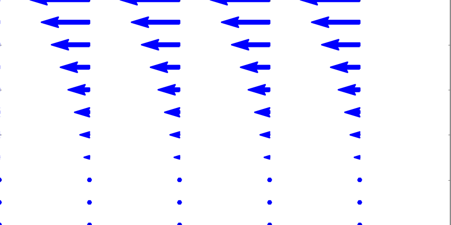

<section data-markdown>

On Wednesday, you took an assessment of electromagnetism concepts.

**How did that assessment feel for you?**

1. I think it went fine; I felt like I knew most of the answers.
2. I was concerned about one or two questions; but most of the questions were familiar.
3. I guessed (or left blank) most of the questions; none of the questions really felt familiar.

</section>

<section data-markdown>

### Announcements

* Homework Help Session
    * Wednesday 6-7pm+ in 1300 BPS
    * Thursday 6-7pm+ in 1400 BPS
* Any trouble installing/using Python?
    * Check the Piazza forum for help

</section>

<section data-markdown>

## Lecture 2: Mathematical Preliminaries

$\nabla\cdot\mathbf{E} = \frac{\rho}{\epsilon_0} \qquad \int \mathbf{E}\cdot d\mathbf{A} = \int \frac{\rho}{\epsilon_0} d\tau$

$\nabla\cdot\mathbf{B} = 0 \qquad \int \mathbf{B} \cdot d\mathbf{A} = 0$

$\nabla\times\mathbf{E} = - \frac{\partial\mathbf{B}}{\partial t} \qquad \int \mathbf{E} \cdot d\mathbf{l} = - \int \frac{\partial\mathbf{B}}{\partial t} \cdot d\mathbf{A}$

$\nabla\times\mathbf{B} = \mu_0\mathbf{J} + \mu_0\epsilon_0\frac{\partial\mathbf{E}}{\partial t} \qquad \int \mathbf{B} \cdot d\mathbf{A} = \mu_0 \int \left(\mathbf{J} + \epsilon_0 \frac{\partial\mathbf{E}}{\partial t}\right) \cdot d\mathbf{A} $

Note:
There's a reason that we are starting with vectors and vector operations; it's inherent in the way electromagnetism is described!
</section>

<section data-markdown>

Two charges +Q and -Q are fixed a distance r apart.  The direction of the force on a test charge -q at  A is...

1. Up
2. Down
3. Left
4. Right
5. Some other direction, or $F = 0$

Note:
* CORRECT ANSWER:  A
* Use superposition

</section>

<section data-markdown>

In a typical Cartesian coordinate system, vector $\mathbf{A}$ lies along the $+\hat{x}$ direction and vector $\mathbf{B}$ lies along the $-\hat{y}$ direction. What is the direction of $\mathbf{A} \times \mathbf{B}$?

1. $-\hat{x}$
2. $+\hat{y}$
3. $+\hat{z}$
4. $-\hat{z}$
5. Can't tell

Note:
* Correct Answer: D
* Use the right-hand rule

</section>

<section data-markdown>

In a typical Cartesian coordinate system, vector $\mathbf{A}$ lies along the $+\hat{x}$ direction and vector $\mathbf{B}$ lies along the $-\hat{y}$ direction. What is the direction of $\mathbf{B} \times \mathbf{A}$?

1. $-\hat{x}$
2. $+\hat{y}$
3. $+\hat{z}$
4. $-\hat{z}$
5. Can't tell

Note:
* Correct Answer: C
* Use right-hand rule; means $\mathbf{A} \times \mathbf{B} = - \mathbf{B} \times \mathbf{A}$
</section>

<section data-markdown>

### You derive it

Consider the radial unit vector ($\hat{r}$) in the spherical coordinate system as shown in the figure to the right. Determine the components of this unit vector in the Cartesian $(x,y,z)$ system.

Note:
This demonstrates that the r unit vector is a curious thing, in fact in contains all the information that is needed to define where you on the unit sphere. The other vectors can be though of as defined relative to that.
</section>
<section data-markdown>

In cylindrical (2D) coordinates, what would be the correct description of the position vector $\mathbf{r}$ of the point P shown at $(x,y) = (1, 1)$?

1. $\mathbf{r} = \sqrt{2} \hat{s}$
2. $\mathbf{r} = \sqrt{2} \hat{s} + \pi/4 \hat{\phi}$
3. $\mathbf{r} = \sqrt{2} \hat{s} - \pi/4 \hat{\phi}$
4. $\mathbf{r} = \pi/4 \hat{\phi}$
5. Something else entirely

Note:
* CORRECT ANSWER:  A
* INSTRUCTOR NOTES This was the "review" question to start class. We had done almost exactly the same question at the start of the previous class, so I thought it would be even higher. (The position vector is different from the coordinates! Students seem to be confused about this - the point P has r=Sqrt[2], phi=pi/4, but it is certainly not the case that, e.g.  B would be the position vector. The units aren't even correct!)   -SJP

</section>

<section data-markdown>

How is the vector $\mathfrak{R}_{12}$ related to $\mathbf{r}_1$ and  $\mathbf{r}_2$?

1. $\mathfrak{R}_{12} = \mathbf{r}_1 +\mathbf{r}_2$
1. $\mathfrak{R}_{12} = \mathbf{r}_1 - \mathbf{r}_2$
1. $\mathfrak{R}_{12} = \mathbf{r}_2 - \mathbf{r}_1$
4. None of these

Note:
* CORRECT ANSWER:  C

</section>

<section data-markdown>

Coulomb's Law: $\mathbf{F}  = \frac{k q_1 q_2}{\left|\mathfrak{R}\right|^2}\hat{\mathfrak{R}}$ where $\mathfrak{R}$ is the relative position vector. In the figure, $q_1$ and $q_2$ are 2 m apart. Which arrow **can** represent $\hat{\mathfrak{R}}$?

1. A
2. B
3. C
4. More than one (or NONE) of the above
5. You can't decide until you know if $q_1$ and $q_2$ are the same or opposite charges

Note:
* CORRECT ANSWER: D
* A unit vector has no units; so it's length is meaningless on a picture with units.

</section>

<section data-markdown>

You are trying to compute the work done by a force, $\mathbf{F} = a\hat{x} + x\hat{y}$, along the line $y=2x$ from $\langle 0,0 \rangle$ to $\langle 1,2 \rangle$. What is $d\mathbf{l}$?

1. $dl$
2. $dx\;\hat{x}$
3. $dy\;\hat{y}$
4. $2dx\;\hat{x}$
5. Something else

Note:
* CORRECT ANSWER: E
* It's $dx\;\hat{x}+dy\;\hat{y}$.

</section>

<section data-markdown>

You are trying to compute the work done by a force, $\mathbf{F} = a\hat{x} + x\hat{y}$, along the line $y=2x$ from $\langle 0,0 \rangle$ to $\langle 1,2 \rangle$. Given that $d\mathbf{l} = dx\;\hat{x}+dy\;\hat{y}$, which of the following forms of the integral is correct?

1. $\int_0^1 a\;dx + \int_0^2 x\;dy$
2. $\int_0^1 (a\;dx + 2x\;dx)$
3. $\frac{1}{2} \int_0^2 (a\;dy + y\;dy)$
4. More than one is correct

Note:
* CORRECT ANSWER: D
* All are correct forms, but B and C are ready to integrate.

</section>

<section data-markdown>

A certain fluid has a velocity field given by $\mathbf{v} = x\hat{x} + z \hat{y}$. Which component(s) of the field contributed to "fluid flux" integral ($\int_S \mathbf{v}\cdot d\mathbf{A}$) through the x-z plane?

1. $v_x$
2. $v_y$
3. both
4. neither

Note:
* CORRECT ANSWER: B
* Only the vector perpendicular to the surface will contribute

</section>

<section data-markdown>

For the same fluid with velocity field given by $\mathbf{v} = x\hat{x} + z \hat{y}$. What is the value of the "fluid flux" integral ($\int_S \mathbf{v}\cdot d\mathbf{A}$) through the entire x-y plane?

1. It is zero
2. It is something finite
3. It is infinite
4. I can't tell without doing the integral

Note:
* CORRECT ANSWER: A
* The velocity field is parallel to the x-y plane every where and hence contributes no flux through the surface.

</section>

<section data-markdown>

A rod (radius $R$) with a hole (radius $r$) drilled down its entire length $L$ has a mass density of $\frac{\rho_0\phi}{\phi_0}$ (where $\phi$ is the normal polar coordinate).

To find the total mass of this rod, which coordinate system should be used (take note that the mass density varies as a function of angle):

1. Cartesian ($x,y,z$)
2. Spherical ($r,\phi,\theta$)
3. Cylindrical ($s, \phi, z$)
4. It doesn't matter, just pick one.

Note:
* CORRECT ANSWER: C
* It makes the most sense from the geometry of the problem and writing the limits.

</section>

<section data-markdown>

Which of the following two fields has zero divergence?

| I | II |
|:-:|:-:|
|  |  |

1. Both do.
2. Only I is zero
3. Only II is zero
4. Neither is zero
5. ???

Note:
* CORRECT ANSWER: B
* Think about dE/dx and dE/dy

</section>

<section data-markdown>

Which of the following two fields has zero curl?

| I | II |
|:-:|:-:|
|  |  |

1. Both do.
2. Only I is zero
3. Only II is zero
4. Neither is zero
5. ???

Note:
* CORRECT ANSWER: C
* Think about paddle wheel
</section>

<section data-markdown>
Consider a vector field defined as the gradient of some well-behaved scalar function:
$$\mathbf{v}(x,y,z) = \nabla T(x,y,z).$$

What is the value of $\oint_C \mathbf{v} \cdot d\mathbf{l}$?

1. Zero
2. Non-zero, but finite
3. Can't tell without a function for $T$

Note:
* CORRECT ANSWER: A
* Closed loop integral of a gradient is zero.

</section>
