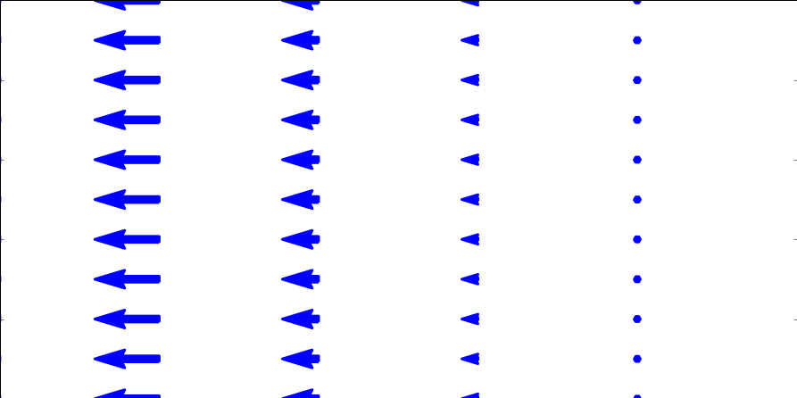

<section data-markdown>

You are trying to compute the work done by a force, $\mathbf{F} = a\hat{x} + x\hat{y}$, along the line $y=2x$ from $\langle 0,0 \rangle$ to $\langle 1,2 \rangle$. What is $d\mathbf{l}$?

1. $dl$
2. $dx\;\hat{x}$
3. $dy\;\hat{y}$
4. $2dx\;\hat{x}$
5. Something else

Note:
* CORRECT ANSWER: E
* It's $dx\;\hat{x}+dy\;\hat{y}$.

</section>

<section data-markdown>
### Announcements

* **Homework 1 (Due Friday)**
* Homework Help Session
   * Tonight 6-7pm+ (1300 BPS)
   * Tomorrow 6 -7pm+ (1400 BPS)
* Some helpful posts on Piazza already
* Clickers won't be counted until next Monday
   * 8AF4EB95, A185FEDA are unregistered

</section>

<section data-markdown>

You are trying to compute the work done by a force, $\mathbf{F} = a\hat{x} + x\hat{y}$, along the line $y=2x$ from $\langle 0,0 \rangle$ to $\langle 1,2 \rangle$. Given that $d\mathbf{l} = dx\;\hat{x}+dy\;\hat{y}$, which of the following forms of the integral is correct?

1. $\int_0^1 a\;dx + \int_0^2 x\;dy$
2. $\int_0^1 (a\;dx + 2x\;dx)$
3. $\frac{1}{2} \int_0^2 (a\;dy + y\;dy)$
4. More than one is correct

Note:
* CORRECT ANSWER: D
* All are correct forms, but B and C are ready to integrate.

</section>

<section data-markdown>

A certain fluid has a velocity field given by $\mathbf{v} = x\hat{x} + z \hat{y}$. Which component(s) of the field contributed to "fluid flux" integral ($\int_S \mathbf{v}\cdot d\mathbf{A}$) through the x-z plane?

1. $v_x$
2. $v_y$
3. both
4. neither

Note:
* CORRECT ANSWER: B
* Only the vector perpendicular to the surface will contribute

</section>

<section data-markdown>

For the same fluid with velocity field given by $\mathbf{v} = x\hat{x} + z \hat{y}$. What is the value of the "fluid flux" integral ($\int_S \mathbf{v}\cdot d\mathbf{A}$) through the entire x-y plane?

1. It is zero
2. It is something finite
3. It is infinite
4. I can't tell without doing the integral

Note:
* CORRECT ANSWER: A
* The velocity field is parallel to the x-y plane every where and hence contributes no flux through the surface.

</section>

<section data-markdown>

A rod (radius $R$) with a hole (radius $r$) drilled down its entire length $L$ has a mass density of $\frac{\rho_0\phi}{\phi_0}$ (where $\phi$ is the normal polar coordinate).

To find the total mass of this rod, which coordinate system should be used (take note that the mass density varies as a function of angle):

1. Cartesian ($x,y,z$)
2. Spherical ($r,\phi,\theta$)
3. Cylindrical ($s, \phi, z$)
4. It doesn't matter, just pick one.

Note:
* CORRECT ANSWER: C
* It makes the most sense from the geometry of the problem and writing the limits.

</section>

<section data-markdown>

Which of the following two fields has zero divergence?

| I | II |
|:-:|:-:|
|  |  |

1. Both do.
2. Only I is zero
3. Only II is zero
4. Neither is zero
5. ???

Note:
* CORRECT ANSWER: B
* Think about dE/dx and dE/dy

</section>

<section data-markdown>

Which of the following two fields has zero curl?

| I | II |
|:-:|:-:|
|  |  |

1. Both do.
2. Only I is zero
3. Only II is zero
4. Neither is zero
5. ???

Note:
* CORRECT ANSWER: C
* Think about paddle wheel
</section>

<section data-markdown>
Consider a vector field defined as the gradient of some well-behaved scalar function:
$$\mathbf{v}(x,y,z) = \nabla T(x,y,z).$$

What is the value of $\oint_C \mathbf{v} \cdot d\mathbf{l}$?

1. Zero
2. Non-zero, but finite
3. Can't tell without a function for $T$

Note:
* CORRECT ANSWER: A
* Closed loop integral of a gradient is zero.

</section>
