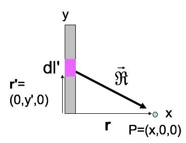

<section data-markdown>

$\mathbf{E}(\mathbf{r}) = \int \dfrac{\lambda dl'}{4\pi\varepsilon_0\mathfrak{R}^3}\vec{\mathfrak{R}}$, so: $E_x(x,0,0) = \dfrac{\lambda}{4\pi\varepsilon_0}\int \dots$

1. $\int \dfrac{dy'x}{x^3}$
2. $\int \dfrac{dy' x}{(x^2 + y'^2)^{3/2}}$
3. $\int \dfrac{dy' y'}{x^3}$
4. $\int \dfrac{dy' y'}{(x^2+y'^2)^{3/2}}$
5. Something else

Note:
CORRECT ANSWER: B

</section>

<section data-markdown>

What do you expect to happen to the field as you get really far from the rod?

$$E_x = \dfrac{\lambda}{4\pi\varepsilon_0\}\dfrac{L}{x\sqrt{x^2+L^2}}$$

1. $E_x$ goes to 0.
2. $E_x$ begins to look like a point charge.
3. $E_x$ goes to $\infty$.
4. More than one of these is true.
5. I can't tell what should happen to $E_x$.

Note:
CORRECT ANSWER: D (A and B)

</section>

<section data-markdown>

**Activity:**

You determine that a particular electrostatics problem cannot be integrated analytically. How do you instruct a computer to do it for you?

Work with those around you to come up with a series of instructions (in plain words) to tell the computer to do it.

</section>

<section data-markdown>

Given the location of the little bit of charge ($dq$), what is $|\vec{\mathfrak{R}}|$?

1. $\sqrt{z^2+r'^2}$
2. $\sqrt{z^2+r'^2-2zr'\cos\theta}$
3. $\sqrt{z^2+r'^2+2zr'\cos\theta}$
4. Something else

Note:
CORRECT ANSWER: B

</section>
