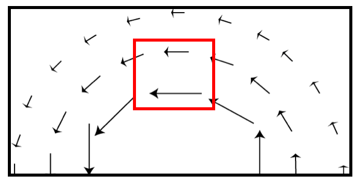

<section data-markdown>

## Electric Potential

</section>

<section data-markdown>

Which of the following two fields has zero curl?

| I | II |
|:-:|:-:|
|  |  |

1. Both do.
2. Only I is zero
3. Only II is zero
4. Neither is zero
5. ???

Note:
* CORRECT ANSWER: C
* Think about paddle wheel
* Fall 2016: 9 0 [89] 3 0
</section>

<section data-markdown>

What is the curl of the vector field, $\mathbf{v}= c\hat{\phi}$, in the region shown below?

1. non-zero everywhere
2. zero at some points, non-zero at others
3. zero curl everywhere

</section>

<section data-markdown>

What is the curl of this vector field, in the red region shown below?

1. non-zero everywhere in the box
2. non-zero at a limited set of points
3. zero curl everywhere shown
4. we need a formula to decide

</section>

<section data-markdown>

What is the curl of this vector field, $\mathbf{v} = \dfrac{c}{s}\hat{\phi}$, in the red region shown below?

1. non-zero everywhere in the box
2. non-zero at a limited set of points
3. zero curl everywhere shown

</section>

<section data-markdown>

Is it mathematically ok to do this?

$$\mathbf{E} = \dfrac{1}{4\pi\varepsilon_0}\int_V\rho(\mathbf{r}')d\tau'\left(-\nabla\dfrac{1}{\mathfrak{R}}\right)$$

$$\longrightarrow \mathbf{E} =-\nabla\left( \dfrac{1}{4\pi\varepsilon_0}\int_V\rho(\mathbf{r}')d\tau'\dfrac{1}{\mathfrak{R}}\right)$$

1. Yes
2. No
3. ???
</section>

<section data-markdown>

If $\nabla \times \mathbf{E} = 0$, then $\oint_C \mathbf{E} \cdot d\mathbf{l} =$

1. 0
2. something finite
3. $\infty$
4. Can't tell without knowing $C$

</section>

<section data-markdown>

Can superposition be applied to electric potential, $V$?

$$V_{tot} \stackrel{?}{=} \sum_i V_i = V_1 +V_2 + V_3 + \dots$$

1. Yes
2. No
3. Sometimes

Note:
As long as the zero potential is the same for all measurements.

</section>

<section data-markdown>

The potential is zero at some point in space.

You can conclude that:
1. The E-field is zero at that point
2. The E-field is non-zero at that point
3. You can conclude nothing at all about the E-field at that point

</section>

<section data-markdown>

The potential is constant everywhere along a line in space.

You can conclude that:
1. The E-field has a constant magnitude along the line.
2. The E-field is zero along that line.
3. You can conclude nothing at all about the magnitude of $\mathbf{E}$ along that line.

</section>

<section data-markdown>

A spherical *shell* has a uniform positive charge density on its surface. (There are no other charges around.)

What is the electric field *inside* the sphere?
1. $\mathbf{E}=0$ everywhere inside
2. $\mathbf{E}$ is non-zero everywhere in the sphere
3. $\mathbf{E}=0$ only that the very center, but non-zero elsewhere inside the sphere.
4. Not enough information given
</section>

<section data-markdown>

Could this be a plot of $\left|\mathbf{E}(r)\right|$? Or $V(r)$? (for SOME physical situation?)

1. Could be $E(r)$, or $V(r)$
2. Could be $E(r)$, but can't be $V(r)$
3. Can't be $E(r)$, could be $V(r)$
4. Can't be either
5. ???

</section>
