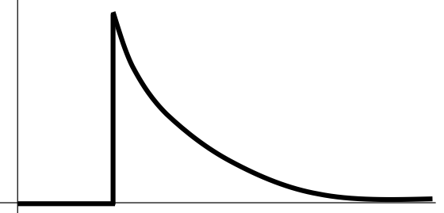

<section data-markdown>

The potential is zero at some point in space.

You can conclude that:
1. The E-field is zero at that point
2. The E-field is non-zero at that point
3. You can conclude nothing at all about the E-field at that point

</section>

<section data-markdown>

The potential is constant everywhere along a line in space.

You can conclude that:
1. The E-field has a constant magnitude along the line.
2. The E-field is zero along that line.
3. You can conclude nothing at all about the magnitude of $\mathbf{E}$ along that line.

</section>

<section data-markdown>

A spherical *shell* has a uniform positive charge density on its surface. (There are no other charges around.)

What is the electric field *inside* the sphere?
1. $\mathbf{E}=0$ everywhere inside
2. $\mathbf{E}$ is non-zero everywhere in the sphere
3. $\mathbf{E}=0$ only that the very center, but non-zero elsewhere inside the sphere.
4. Not enough information given
</section>

<section data-markdown>

Could this be a plot of $\left|\mathbf{E}(r)\right|$? Or $V(r)$? (for SOME physical situation?)

1. Could be $E(r)$, or $V(r)$
2. Could be $E(r)$, but can't be $V(r)$
3. Can't be $E(r)$, could be $V(r)$
4. Can't be either
5. ???

</section>
