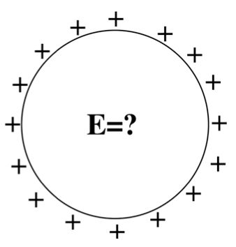

<section data-markdown>

The potential is zero at some point in space.

You can conclude that:
1. The E-field is zero at that point
2. The E-field is non-zero at that point
3. You can conclude nothing at all about the E-field at that point

</section>

<section data-markdown>

The potential is constant everywhere along a line in space.

You can conclude that:
1. The E-field has a constant magnitude along the line.
2. The E-field is zero along that line.
3. You can conclude nothing at all about the magnitude of $\mathbf{E}$ along that line.

</section>

<section data-markdown>

A spherical *shell* has a uniform positive charge density on its surface. (There are no other charges around.)

What is the electric field *inside* the sphere?
1. $\mathbf{E}=0$ everywhere inside
2. $\mathbf{E}$ is non-zero everywhere in the sphere
3. $\mathbf{E}=0$ only that the very center, but non-zero elsewhere inside the sphere.
4. Not enough information given
</section>

<section data-markdown>

Could this be a plot of $\left|\mathbf{E}(r)\right|$? Or $V(r)$? (for SOME physical situation?)

1. Could be $E(r)$, or $V(r)$
2. Could be $E(r)$, but can't be $V(r)$
3. Can't be $E(r)$, could be $V(r)$
4. Can't be either
5. ???

</section>

<section data-markdown>

We usually choose $V(r\rightarrow\infty) \equiv 0$ when calculating the potential of a point charge to be $V(r) = +kq/r$. How does the potential $V(r)$ change if we choose our reference point to be $V(R) = 0$ where $R$ is close to $+q$.

1. $V(r)$ is positive but smaller than $kq/r$
2. $V(r)$ is positive but larger than $kq/r$
3. $V(r)$ is negative
4. $V(r)$ doesn’t change ($V$ is independent of  choice of reference)

Note:
CORRECT ANSWER: C

</section>

<section data-markdown>

### Electrostatic Potential Energy

</section>

<section data-markdown>

Three identical charges $+q$ sit on an equilateral triangle. What would be the final $KE$ of the top charge if you released it (keeping the other two fixed)?

1. $\frac{1}{4\pi\varepsilon_0}\frac{q^2}{a}$
2. $\frac{1}{4\pi\varepsilon_0}\frac{2q^2}{3a}$
3. $\frac{1}{4\pi\varepsilon_0}\frac{2q^2}{a}$
4. $\frac{1}{4\pi\varepsilon_0}\frac{3q^2}{a}$
5. Other

Note:
CORRECT ANSWER: C

</section>

<section data-markdown>

Three identical charges $+q$ sit on an equilateral triangle. What would be the final $KE$ of the top charge if you released *all three*?

1. $\frac{1}{4\pi\varepsilon_0}\frac{q^2}{a}$
2. $\frac{1}{4\pi\varepsilon_0}\frac{2q^2}{3a}$
3. $\frac{1}{4\pi\varepsilon_0}\frac{2q^2}{a}$
4. $\frac{1}{4\pi\varepsilon_0}\frac{3q^2}{a}$
5. Other

Note:
CORRECT ANSWER: A

</section>

<section data-markdown>

Two charges, $+q$ and $-q$, are a distance $r$ apart.  As the charges are slowly moved together, the total field energy

$$\dfrac{\varepsilon_0}{2}\int E^2 d\tau$$

1. increases
2. decreases
3. remains constant

Note:
CORRECT ANSWER: B
</section>

<section data-markdown>

A parallel-plate capacitor has $+Q$ on one plate, $-Q$ on the other.  The plates are isolated so the charge $Q$ cannot change.  As the plates are pulled apart, the total electrostatic energy stored in the capacitor:

1. increases
2. decreases
3. remains constant.

Note:
CORRECT ANSWER: A
</section>
