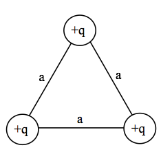

<section data-markdown>

True or False: The electric field, $\mathbf{E(\mathbf{r})}$, in some region of space is zero, thus the electric potential, $V(\mathbf{r})$, in that same region of space is zero.

1. True
2. False

Note:
* CORRECT ANSWER: B
* The electric potential is a constant in the region; it might be zero, but doesn't have to be.

</section>

<section data-markdown>

True or False: The electric potential, $V(\mathbf{r})$, in some region of space is zero, thus the electric field, $\mathbf{E(\mathbf{r})}$, in that same region of space is zero.

1. True
2. False

Note:
* CORRECT ANSWER: A
* If the potential is zero in that space is zero, then it's gradient is zero in that space, so E must be zero also.

</section>

<section data-markdown>

### Announcements

* Exam 1 is October 5th (next Wednesday)
  * Coverage: Griffiths Ch 1, Ch 2.1-2.4
  * Mathematics (including $\delta$ functions), Coulomb and Gauss, Potential and Energy
  * Specific topic/questions on Wednesday
* No homework due next week
  * Homework 5 will be a touch longer

</section>

<section data-markdown>
Should we post Homework 5 on Friday or wait to post it until after Exam 1?

1. Post it on Friday.
2. Post it after Exam 1.
3. I don't care either way, but I won't work on it until after Exam 1.
</section>

<section data-markdown>

We usually choose $V(r\rightarrow\infty) \equiv 0$ when calculating the potential of a point charge to be $V(r) = +kq/r$. How does the potential $V(r)$ change if we choose our reference point to be $V(R) = 0$ where $R$ is close to $+q$.

1. $V(r)$ higher than it was before
2. $V(r)$ is lower than it was before
4. $V(r)$ doesn’t change ($V$ is independent of  choice of reference)

Note:
* CORRECT ANSWER: B
* Show redefinition.

</section>

<section data-markdown>

### Electrostatic Potential Energy

</section>

<section data-markdown>

Three identical charges $+q$ sit on an equilateral triangle. What would be the final $KE$ of the top charge if you released it (keeping the other two fixed)?

1. $\frac{1}{4\pi\varepsilon_0}\frac{q^2}{a}$
2. $\frac{1}{4\pi\varepsilon_0}\frac{2q^2}{3a}$
3. $\frac{1}{4\pi\varepsilon_0}\frac{2q^2}{a}$
4. $\frac{1}{4\pi\varepsilon_0}\frac{3q^2}{a}$
5. Other

Note:
CORRECT ANSWER: C

</section>

<section data-markdown>

Three identical charges $+q$ sit on an equilateral triangle. What would be the final $KE$ of the top charge if you released *all three*?

1. $\frac{1}{4\pi\varepsilon_0}\frac{q^2}{a}$
2. $\frac{1}{4\pi\varepsilon_0}\frac{2q^2}{3a}$
3. $\frac{1}{4\pi\varepsilon_0}\frac{2q^2}{a}$
4. $\frac{1}{4\pi\varepsilon_0}\frac{3q^2}{a}$
5. Other

Note:
CORRECT ANSWER: A

</section>

<section data-markdown>

Two charges, $+q$ and $-q$, are a distance $r$ apart.  As the charges are slowly moved together, the total field energy

$$\dfrac{\varepsilon_0}{2}\int E^2 d\tau$$

1. increases
2. decreases
3. remains constant

Note:
* CORRECT ANSWER: B
* Consider when they overlap, field goes to zero, must be E gets smaller as they get closer. same volume
</section>

<section data-markdown>

A parallel-plate capacitor has $+Q$ on one plate, $-Q$ on the other.  The plates are isolated so the charge $Q$ cannot change.  As the plates are pulled apart, the total electrostatic energy stored in the capacitor:

1. increases
2. decreases
3. remains constant.

Note:
* CORRECT ANSWER: A
* Same E; constant; larger volume where it is non-zero
</section>
