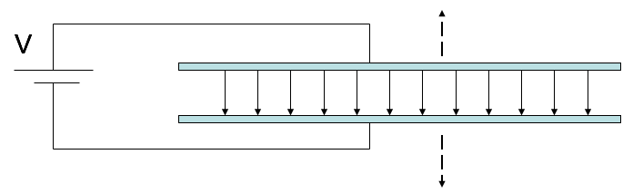

<section data-markdown>

Does system energy "superpose"?

That is, if you have one system of charges with total stored energy $W_1$, and a second charge distribution with $W_2$...if you superpose these charge distributions, is the total energy of the new system simply $W_1 + W_2$?

1. Yes
2. No

Note:
* CORRECT ANSWER: B
* Draw 4 charges and show that it is not the sum of the 2 charges and the other 2.

</section>

<section data-markdown>
### Exam 1 Information

* Exam 1 on Wednesday, October 5th
* Arrive on time!
* We will provide Formula Sheets (posted on Piazza already)
* You can bring one-side of a sheet of paper with your own notes.
* 4 questions - True/False, Essay, Graphing, Calculations

</section>

<section data-markdown>
### What's on Exam 1?

* Identify whether conceptual statements about $\mathbf{E}$, $V$, and/or $\rho$ are true or false.
* Sketch and discuss delta functions in relation to charge density, $\rho$
* Calculate the electric potential, $V$, for a specific charge distribution and discuss what happens in limiting cases
* Calculate the electric field, $\mathbf{E}$, inside and outside a continuous distribution of charge and sketch the results

</section>

<section data-markdown>

Two charges, $+q$ and $-q$, are a distance $r$ apart.  As the charges are slowly moved together, the total field energy

$$\dfrac{\varepsilon_0}{2}\int E^2 d\tau$$

1. increases
2. decreases
3. remains constant

Note:
* CORRECT ANSWER: B
* Consider when they overlap, field goes to zero, must be E gets smaller as they get closer. same volume
</section>

<section data-markdown>

A parallel-plate capacitor has $+Q$ on one plate, $-Q$ on the other.  The plates are isolated so the charge $Q$ cannot change.  As the plates are pulled apart, the total electrostatic energy stored in the capacitor:

1. increases
2. decreases
3. remains constant.

Note:
* CORRECT ANSWER: A
* Same E; constant; larger volume where it is non-zero
</section>

<section data-markdown>

### Conductors

</section>

<section data-markdown>

### The conductor problem

</section>

<section data-markdown>

A point charge $+q$ sits outside a **solid neutral conducting copper sphere** of radius $A$. The charge q is a distance $r > A$ from the center, on the right side. What is the E-field at the center of the sphere? (Assume equilibrium situation).

1. $|E| = kq/r^2$, to left
2. $kq/r^2 > |E| > 0$, to left
3. $|E| > 0$, to right
4. $E = 0$
5. None of these

Note:
* CORRECT ANSWER: D
* Net electric field inside of a metal in static equilibrium is zero
* Talk about the net field versus the field due to the charges on the metal.

</section>

<section data-markdown>

In the previous question, suppose **the copper sphere is charged**, total charge $+Q$. (We are still in static equilibrium.) What is now the magnitude of the E-field at the center of the sphere?

1. $|E| = kq/r^2$
2. $|E| = kQ/A^2$
3. $|E| = k(q-Q)/r^2$
4. $|E| = 0$
5. None of these! / it’s hard to compute

Note:
* CORRECT ANSWER: D
* Talk about the net field versus the field due to the charges on the metal.
</section>

<section data-markdown>

We have a large copper plate with uniform surface charge density
Imagine the Gaussian surface drawn below.  Calculate the E-field a small distance $s$ above the conductor surface.   

1. $|E| = \frac{\sigma}{\varepsilon_0}$
2. $|E| = \frac{\sigma}{2\varepsilon_0}$
3. $|E| = \frac{\sigma}{4\varepsilon_0}$
4. $|E| = \frac{1}{4\pi\varepsilon_0}\frac{\sigma}{s^2}$
5. $|E| = 0$

Note:
* CORRECT ANSWER: A
* Might have to do derivation and go through details of infinitely thin line charge. Must be +sigma on other side, btw.

</section>

<section data-markdown>

A neutral copper sphere has a spherical hollow in the center.  A charge $+q$ is placed in the center of the hollow.  What is the total charge on the outside surface of the copper sphere? (Assume Electrostatic equilibrium.)

1. Zero
2. $-q$
3. $+q$
4. $0 < q_{outer} < +q$
5. $-q < q_{outer} < 0$

</section>

<section data-markdown>

A long coax has total charge $+Q$ on the OUTER conductor. The INNER conductor is neutral.

What is the sign of the potential difference, $\Delta V = V(c)-V(0)$, between the center of the inner conductor ($s = 0$)
and the outside of the outer conductor?

1. Positive
2. Negative
3. Zero

Note:
* CORRECT ANSWER: C

</section>

<section data-markdown>

Given a pair of very large, flat, conducting capacitor plates with total charges $+Q$ and $-Q$. Ignoring edges, what is the equilibrium distribution of the charge?

1. Throughout each plate
2. Uniformly on both side of each plate
3. Uniformly on top of $+Q$ plate and bottom of $–Q$ plate
4. Uniformly on bottom of $+Q$ plate and top of $–Q$ plate
5. Something else

Note:
* CORRECT ANSWER: D

</section>

<section data-markdown>

Given a pair of very large, flat, conducting capacitor plates with surface charge densities $+/-\sigma$, what is the E field in the region between the plates?

1. $\sigma/2\varepsilon_0$
2. $\sigma/\varepsilon_0$
3. $2\sigma/\varepsilon_0$
4. $4\sigma/\varepsilon_0$
5. Something else

Note:
* CORRECT ANSWER: B

</section>

<section data-markdown>

You have two very large parallel plate capacitors, both with the same area and the same charge $Q$.
Capacitor \#1 has twice the gap of Capacitor \#2. Which has more stored potential energy?

1. \#1 has twice the stored energy
2. \#1 has more than twice
3. They both have the same
4. \#2 has twice the stored energy
5. \#2 has more than twice.

Note:
* CORRECT ANSWER: A
* E same; twice volume

</section>

<section data-markdown>

A parallel plate capacitor is attached to a battery which maintains a constant voltage difference V between the capacitor plates.  While the battery is attached, the plates are pulled apart. The electrostatic energy stored in the capacitor

1. increases.
2. decreases.
3. stays constant.

Note:
* CORRECT ANSWER: B
* Potential same; field is reduced; but shows up squared while d is increased, overall goes down
</section>
