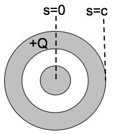

<section data-markdown>

### Tutorial today

* Click 'A' once you finish page 1
* Click 'B' once you finish page 2
* Click 'C' once you finish page 3

</section>

<section data-markdown>

A neutral copper sphere has a spherical hollow in the center.  A charge $+q$ is placed in the center of the hollow.  What is the total charge on the outside surface of the copper sphere? (Assume Electrostatic equilibrium.)

1. Zero
2. $-q$
3. $+q$
4. $0 < q_{outer} < +q$
5. $-q < q_{outer} < 0$

</section>

<section data-markdown>

A long coax has total charge $+Q$ on the OUTER conductor. The INNER conductor is neutral.

What is the sign of the potential difference, $\Delta V = V(c)-V(0)$, between the center of the inner conductor ($s = 0$)
and the outside of the outer conductor?

1. Positive
2. Negative
3. Zero

Note:
* CORRECT ANSWER: C

</section>
