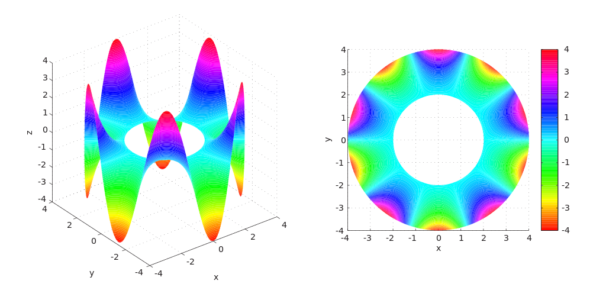
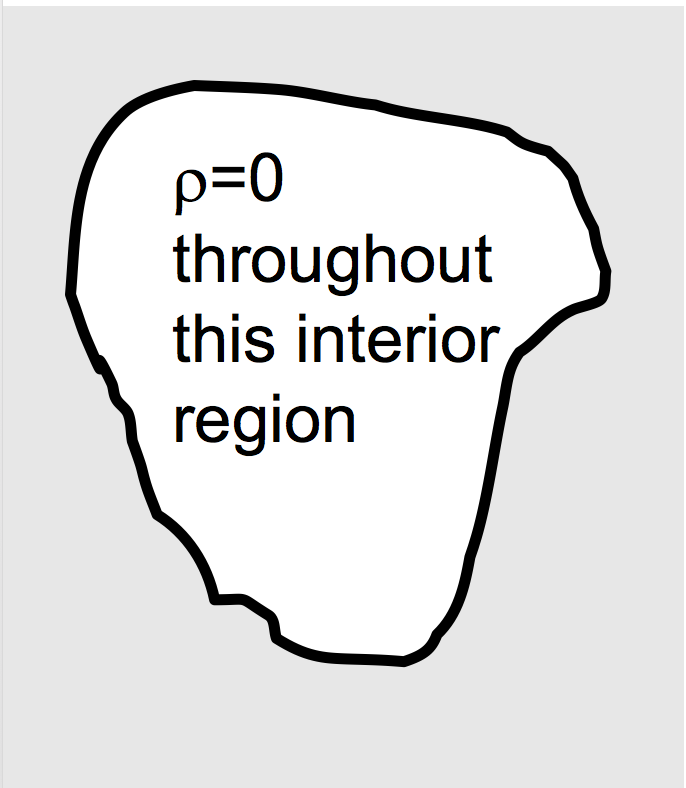

<section data-markdown>

### Laplace's Equation

</section>

<section data-markdown>

A region of space contains no charges. What can I say about V in the interior?

1. Not much, there are lots of possibilities for V(r) in there
2. V(r)=0 everywhere in the interior.
3. V(r)=constant everywhere in the interior

Note:
* CORRECT ANSWER: A

</section>

<section data-markdown>

A region of space contains no charges. The boundary has V=0 everywhere.
What can I say about V in the interior?

1. Not much, there are lots of possibilities for V(r) in there
2. V(r)=0 everywhere in the interior.
3. V(r)=constant everywhere in the interior

Note:
* CORRECT ANSWER: B

</section>

<section data-markdown>

If you put a positive test charge at the center of this cube of charges, could it be in stable equilibrium?

1. Yes
2. No
3. ???

Note:
* CORRECT ANSWER: B

</section>
