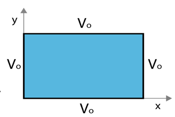

<section data-markdown>

Given the two diff. eq's :

$$\dfrac{1}{X}\dfrac{d^2X}{dx^2} = C_1 \qquad \dfrac{1}{Y}\dfrac{d^2Y}{dy^2} = C_2$$

where $C_1+C_2 = 0$.  Given the boundary conditions in the figure, which coordinate should be assigned to the negative constant (and thus the sinusoidal solutions)?

1. x
2. y
3. $C_1 = C_2 = 0$ here
4. It doesn't matter.

Note:
* CORRECT ANSWER: B
</section>

<section data-markdown>

Given the two diff. eq's :

$$\dfrac{1}{X}\dfrac{d^2X}{dx^2} = C_1 \qquad \dfrac{1}{Y}\dfrac{d^2Y}{dy^2} = C_2$$

where $C_1+C_2 = 0$.  Given the boundary conditions in the figure, which coordinate should be assigned to the negative constant (and thus the sinusoidal solutions)?

1. x
2. y
3. $C_1 = C_2 = 0$ here
4. It doesn't matter.

Note:
* CORRECT ANSWER: C
* It's constant throughout!
</section>

<section data-markdown>

### Announcements
* Exam 1 graded
  * Returned at the end of class today (Avg. 73; Median. 76)
* Sent out individual grade reports on Saturday
  * Please check that your grades make sense to you!
* Homework 5 is due on Friday
  * It's a bit longer...start early!

</section>

<section data-markdown>

When does $\sin(ka)e^{-ky}$ vanish?

1. $k = 0$
2. $k = \pi/(2a)$
3. $k = \pi/a$
4. A and C
5. A, B, C

Note:
* CORRECT ANSWER: D

</section>

<section data-markdown>

Suppose $V_1(r)$ and $V_2(r)$ are linearly independent functions which both solve Laplace's equation, $\nabla^2 V = 0$.

Does $aV_1(r)+bV_2(r)$ also solve it (with $a$ and $b$ constants)?

1. Yes. The Laplacian is a linear operator
2. No. The uniqueness theorem says this scenario is impossible, there are never two independent solutions!
3. It is a definite yes or no, but the reasons given above just aren't right!
4. It depends...

Note:
* CORRECT ANSWER: A

</section>

<section data-markdown>

What is the value of $\int_0^{2\pi} \sin(2x)\sin(3x)\;dx$ ?

1. Zero
2. $\pi$
3. $2 \pi$
4. other
5. I need resources to do an integral like this!

Note:
* CORRECT ANSWER: A
* Orthogonal functions!

</section>

<section data-markdown>

### Separation of Variables (Spherical)

</section>

<section data-markdown>

Given $\nabla^2 V = 0$ in Cartesian coords, we separated $V(x,y,z) = X(x)Y(y)Z(z)$. Will this approach work in spherical coordinates, i.e. can we separate $V(r,\theta,\phi) = R(r)\Theta(\theta)\Phi(\phi)$?

1. Sure.
2. Not quite - the angular components cannot be isolated, e.g., $f(r,\theta,\phi) = R(r)Y(\theta,\phi)$
3. It won't work at all because the spherical form of Laplace's Equation has cross terms in it (see the front cover of Griffiths)

Note:
* CORRECT ANSWER: A

</section>

<section data-markdown>

$$V(r,\theta) = \sum_{l=0}^{\infty} \left(A_l r^l + \dfrac{B_l}{r^{l+1}}\right)P_l(\cos \theta)$$

V everywhere on a spherical shell is a given constant, i.e. $V(R,\theta) = V_0$. There are no charges inside the sphere. Which terms do you expect to appear when finding V(inside)?

1. Many $A_l$ terms (but no $B_l$'s)
2. Many $B_l$ terms (but no $A_l$'s)
3. Just $A_0$
4. Just $B_0$
5. Something else!

Note:
* CORRECT ANSWER: C

</section>

<section data-markdown>

Given $V_0(\theta) = \sum_l C_l P_l(\cos \theta)$, we want to get to the integral:

$$ \int_{-1}^{+1}P_l(u)\;P_m(u)\;du = \dfrac{2}{2+1}\; (\mathrm{for}\;l=m)$$

we can do this by multiplying both sides by:

1. $P_m(\cos \theta)$
2. $P_m(\sin \theta)$
3. $P_m(\cos \theta) \sin \theta$
4. $P_m(\sin \theta) \cos \theta$
5. $P_m(\sin \theta) \sin \theta$

Note:
* CORRECT ANSWER: D

</section>

<section data-markdown>

$$V(r,\theta) = \sum_{l=0}^{\infty} \left(A_l r^l + \dfrac{B_l}{r^{l+1}}\right)P_l(\cos \theta)$$

Suppose V on a spherical shell is:

$$V(R,\theta) = V_0 \left(1+\cos^2\theta\right)$$

Which terms do you expect to appear when finding **V(inside)**?
1. Many $A_l$ terms (but no $B_l$'s)
2. Many $B_l$ terms (but no $A_l$'s)
3. Just $A_0$ and $A_2$
4. Just $B_0$ and $B_2$
5. Something else!

Note:
* CORRECT ANSWER: C

</section>

<section data-markdown>

$$V(r,\theta) = \sum_{l=0}^{\infty} \left(A_l r^l + \dfrac{B_l}{r^{l+1}}\right)P_l(\cos \theta)$$

Suppose V on a spherical shell is:

$$V(R,\theta) = V_0 \left(1+\cos^2\theta\right)$$

Which terms do you expect to appear when finding **V(outside)**?
1. Many $A_l$ terms (but no $B_l$'s)
2. Many $B_l$ terms (but no $A_l$'s)
3. Just $A_0$ and $A_2$
4. Just $B_0$ and $B_2$
5. Something else!

Note:
* CORRECT ANSWER: D

</section>

<section data-markdown>

How many boundary conditions (on the potential $V$) do you use to find $V$ inside the spherical plastic shell?

1. 1
2. 2
3. 3
4. 4
5. It depends on $V_0(\theta)$

Note:
* CORRECT ANSWER: B
* Good for discussion; obviously you need the surface BC, but what about at r=0? Is that technically a BC?
</section>
