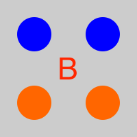

<section data-markdown>

Which of the following distributions could have a dipole contribution to the potential far from the charges?

D. None

E. More than one!

Note:
* CORRECT ANSWER: E
* We didn't specify where the origin!

</section>

<section data-markdown>

## Announcements

* Exam 2 (Wednesday, November 2)
* Will cover through Homework 7 (due next Friday)
* No homework the following week, but Homework 8 will be extra long (assigned on the Exam day).
* Details about what's on the exam will be given next Friday.

</section>

<section data-markdown>

In which situation is the dipole term the leading non-zero contribution to the potential?

1. 1 and 3
2. 2 and 4
3. only 5
4. 1 and 5
5. Some other combo

Note:
* CORRECT ANSWER: D

</section>

<section data-markdown>

## Tutorial

* Click A when you have finished page 1
* Click B when you have finished page 2
* Click C when you have finished page 3

</section>
