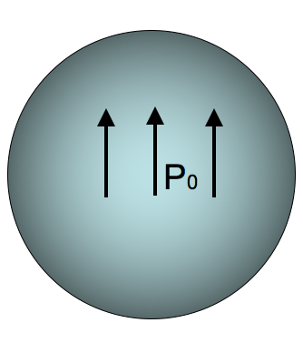

<section data-markdown>

Consider a single point charge at the origin. It will have ONLY a monopole contribution to the potential at a location $\mathbf{r} = \langle x,y,z\rangle$.

As we have seen, if we move the charge to another location (e.g., $\mathbf{r}' = \langle 0,0,d \rangle$), the distribution now has a dipole contribution to the potential at $\mathbf{r}$!

What the hell is going on here?

1. It's just how the math works out. Nothing has changed physically at $\mathbf{r}$.
2. There is something different about the field at $\mathbf{r}$ and the potential is showing us that.
3. I'm not sure how to resolve this problem.

</section>

<section data-markdown>

## Polarization

</section>

<section data-markdown>

A stationary point charge $+Q$ is near a block of polarization material (a linear dielectric).  The net electrostatic force on the block due to the point charge is:

1. attractive (to the left)
2. repulsive (to the right)
3. zero

Note:
* CORRECT ANSWER: A

</section>

<section data-markdown>

The sphere below (radius $a$) has uniform polarization $\mathbf{P}_0$, which points in the $+z$ direction.
What is the total dipole moment of this sphere?

1. zero
2. $\mathbf{P}_0 a^3$
3. $4\pi a^3 \mathbf{P}_0/3$
4. $\mathbf{P}_0$  
5. None of these/must be more complicated  

Note:
* CORRECT ANSWER: C

</section>

<section data-markdown>

The cube below (side $a$) has uniform polarization $\mathbf{P}_0$, which points in the $+z$ direction.
What is the total dipole moment of this cube?

1. zero
2. $a^3 \mathbf{P}_0$
3. $\mathbf{P}_0$
4. $\mathbf{P}_0/a^3$
5. $2 \mathbf{P}_0 a^2$  

Note:
* CORRECT ANSWER: B

</section>

<section data-markdown>

In the following case, is the bound surface and volume charge zero or nonzero?

1. $\sigma_b = 0, \rho_b \neq 0$
2. $\sigma_b \neq 0, \rho_b \neq 0$
3. $\sigma_b = 0, \rho_b=0$
4. $\sigma_b \neq 0, \rho_b=0$

Note:
* CORRECT ANSWER:  D

</section>

<section data-markdown>

In the following case, is the bound surface and volume charge zero or nonzero?

1. $\sigma_b = 0, \rho_b \neq 0$
2. $\sigma_b \neq 0, \rho_b \neq 0$
3. $\sigma_b = 0, \rho_b=0$
4. $\sigma_b \neq 0, \rho_b=0$

Note:
* CORRECT ANSWER:  B

</section>

<section data-markdown>

A VERY thin slab of thickness $d$ and area $A$ has volume charge density $\rho = Q / V$. Because it's so thin, we may think of it as a surface charge density $\sigma = Q / A$.

The relation between $\rho$ and $\sigma$ is:
1. $\sigma = \rho$
2. $\sigma = \rho d$		
3. $\sigma = \rho/d$
4. $\sigma = V \rho$		
5. $\sigma = \rho/V$

Note:
* CORRECT ANSWER: B

</section>

<section data-markdown>

A dielectric slab (top area $A$, height $h$) has been polarized, with $\mathbf{P}=P_0$ in the $+z$ direction. What is the surface charge density, $\sigma_b$, on the bottom surface?

1. 0
2. $-P_0$
3. $P_0$
4. $P_0 A h$
5. $P_0 A$

Note:
* CORRECT ANSWER: B

</section>

<section data-markdown>

Are $\rho_b$ and $\sigma_b$ due to real charges?

1. Of course not! They are as fictitious as it gets!
2. Of course they are!  They are as real as it gets!
3. I have no idea  

Note:
* CORRECT ANSWER: B
</section>

<section data-markdown>

A dielectric sphere is uniformly polarized,

$$\mathbf{P} = +P_0\hat{z}$$

What is the surface charge density?

1. 0
2. Non-zero Constant
3. constant*$\sin \theta$
4. constant*$\cos \theta$
5.  ??

Note:
* CORRECT ANSWER: D

</section>

<section data-markdown>
A dielectric sphere is uniformly polarized,

$$\mathbf{P} = +P_0\hat{z}$$

What is the volume charge density?

1. 0
2. Non-zero Constant
3. Depends on $r$, but not $\theta$
4. Depends on $\theta$, but not $r$
5. ?

Note:
* CORRECT ANSWER: A

</section>

<section data-markdown>

If we push this conductor inside the isolated capacitor, will it be drawn into the capacitor or repelled?

1. It gets sucked into the capacitor
2. It gets pushed out from the capacitor
3. I just don’t know.

Note:
* CORRECT ANSWER: A

</section>

<section data-markdown>

If we push this dielectric inside the isolated capacitor, will it be drawn into the capacitor or repelled?

1. It gets sucked into the capacitor
2. It gets pushed out from the capacitor
3. I just don’t know.

Note:
* CORRECT ANSWER: A

</section>
