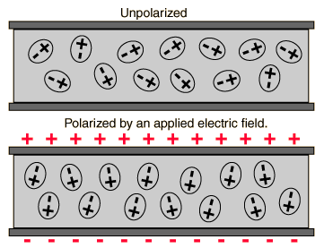

<section data-markdown>

Consider a single point charge at the origin. It will have ONLY a monopole contribution to the potential at a location $\mathbf{r} = \langle x,y,z\rangle$.

As we have seen, if we move the charge to another location (e.g., $\mathbf{r}' = \langle 0,0,d \rangle$), the distribution now has a dipole contribution to the potential at $\mathbf{r}$!

What the hell is going on here?

1. It's just how the math works out. Nothing has changed physically at $\mathbf{r}$.
2. There is something different about the field at $\mathbf{r}$ and the potential is showing us that.
3. I'm not sure how to resolve this problem.

</section>

<section data-markdown>

## Polarization

</section>

<section data-markdown>

A stationary point charge $+Q$ is near a block of polarization material (a linear dielectric).  The net electrostatic force on the block due to the point charge is:

1. attractive (to the left)
2. repulsive (to the right)
3. zero

Note:
* CORRECT ANSWER: A

</section>

<section data-markdown>

The sphere below (radius $a$) has uniform polarization $\mathbf{P}_0$, which points in the $+z$ direction.
What is the total dipole moment of this sphere?

1. zero
2. $\mathbf{P}_0 a^3$
3. $4\pi a^3 \mathbf{P}_0/3$
4. $\mathbf{P}_0$  
5. None of these/must be more complicated  

Note:
* CORRECT ANSWER: C

</section>

<section data-markdown>

The cube below (side $a$) has uniform polarization $\mathbf{P}_0$, which points in the $+z$ direction.
What is the total dipole moment of this cube?

1. zero
2. $a^3 \mathbf{P}_0$
3. $\mathbf{P}_0$
4. $\mathbf{P}_0/a^3$
5. $2 \mathbf{P}_0 a^2$  

Note:
* CORRECT ANSWER: B

</section>

<section data-markdown>

In the following case, is the bound surface and volume charge zero or nonzero?

1. $\sigma_b = 0, \rho_b \neq 0$
2. $\sigma_b \neq 0, \rho_b \neq 0$
3. $\sigma_b = 0, \rho_b=0$
4. $\sigma_b \neq 0, \rho_b=0$

Note:
* CORRECT ANSWER:  D

</section>

<section data-markdown>

In the following case, is the bound surface and volume charge zero or nonzero?

1. $\sigma_b = 0, \rho_b \neq 0$
2. $\sigma_b \neq 0, \rho_b \neq 0$
3. $\sigma_b = 0, \rho_b=0$
4. $\sigma_b \neq 0, \rho_b=0$

Note:
* CORRECT ANSWER:  B

</section>
