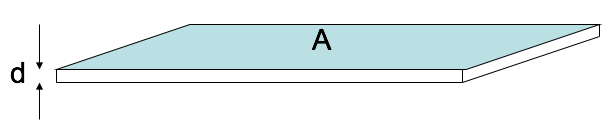

<section data-markdown>

A VERY thin slab of thickness $d$ and area $A$ has volume charge density $\rho = Q / V$. Because it's so thin, we may think of it as a surface charge density $\sigma = Q / A$.

The relation between $\rho$ and $\sigma$ is:
1. $\sigma = \rho$
2. $\sigma = \rho d$
3. $\sigma = \rho/d$
4. $\sigma = V \rho$
5. $\sigma = \rho/V$

Note:
* CORRECT ANSWER: B

</section>

<section data-markdown>

Are $\rho_b$ and $\sigma_b$ due to real charges?

1. Of course not! They are as fictitious as it gets!
2. Of course they are!  They are as real as it gets!
3. I have no idea

Note:
* CORRECT ANSWER: B
</section>

<section data-markdown>

A dielectric slab (top area $A$, height $h$) has been polarized, with $\mathbf{P}=P_0$ in the $+z$ direction. What is the surface charge density, $\sigma_b$, on the bottom surface?

1. 0
2. $-P_0$
3. $P_0$
4. $P_0 A h$
5. $P_0 A$

Note:
* CORRECT ANSWER: B

</section>

<section data-markdown>

A dielectric sphere is uniformly polarized,

$$\mathbf{P} = +P_0\hat{z}$$

What is the surface charge density?

1. 0
2. Non-zero Constant
3. constant*$\sin \theta$
4. constant*$\cos \theta$
5.  ??

Note:
* CORRECT ANSWER: D

</section>

<section data-markdown>
A dielectric sphere is uniformly polarized,

$$\mathbf{P} = +P_0\hat{z}$$

What is the volume charge density?

1. 0
2. Non-zero Constant
3. Depends on $r$, but not $\theta$
4. Depends on $\theta$, but not $r$
5. ?

Note:
* CORRECT ANSWER: A

</section>
