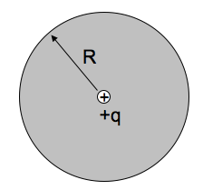

<section data-markdown>

If you put a dielectric in an external field $\mathbf{E}_e$, it polarizes, adding a new field, $\mathbf{E}_p$
(from the bound charges). These superpose, making a total field, $\mathbf{E}_T$.  What is the vector equation relating these three fields?

1. $\mathbf{E}_T + \mathbf{E}_e + \mathbf{E}_p = 0$
2. $\mathbf{E}_T = \mathbf{E}_e - \mathbf{E}_p$
3. $\mathbf{E}_T = \mathbf{E}_e + \mathbf{E}_p$
4. $\mathbf{E}_T = -\mathbf{E}_e + \mathbf{E}_p$
5. Something else

Note:
* CORRECT ANSWER: C
</section>

<section data-markdown>

## Announcements

* Exam 2 (Wednesday, October 2nd in class)
  * Danny will be out; Dennis is in charge
* Covers through Homework 7 (solutions posted after class)
* "Comprehensive" exam (need to remember old stuff)
* 1 sheet of your own notes; formula sheet posted

</section>

<section data-markdown>

## What's on Exam 2?

* Determine the potential everywhere and charge on surface given a boundary condition on surface of sphere.
* Determine the leading order contribution to the potential for a charge distribution; discuss changes that can affect contribution.
* Determine how bound charges are distributed given a particular polarization.
* Explain the process of solving Laplace's equation in Cartesian coordinates and the consequences of the solutions.

</section>

<section data-markdown>

A solid non-conducting dielectric rod has been injected ("doped") with a fixed, known charge distribution $\rho(s)$. (The material responds, polarizing internally.)

When computing $D$ in the rod, do you treat this $\rho(s)$ as the "free charges" or "bound charges"?

1. "free charge"
2. "bound charge"
3. Neither of these - $\rho(s)$ is some combination of free and bound
4. Something else.

Note:
* CORRECT ANSWER: A

</section>

<section data-markdown>

We define "Electric Displacement" or "D" field,
$$\mathbf{D} = \varepsilon_0 \mathbf{E} + \mathbf{P}$$

If you put a dielectric in an **external** field, it polarizes, adding a new **induced** field (from the bound charges). These superpose, making a **total** electric field. Which of these three E fields is the "E" in the formula for D above?

1. $\mathbf{E}_{ext}$
2. $\mathbf{E}_{induced}$
3. $\mathbf{E}_{tot}$

Note:
* CORRECT ANSWER: C

</section>

<section data-markdown>

We define $\mathbf{D} = \varepsilon_0 \mathbf{E} + \mathbf{P}$, with

$$\oint \mathbf{D}\cdot d\mathbf{A} = Q_{free}$$

A point charge $+q$ is placed at the center of a dielectric sphere (radius $R$).  There are no other free charges anywhere.  What is $|\mathbf{D}(r)|$?

1. $q/(4 \pi r^2)$ everywhere
2. $q/(4 \varepsilon_0\pi r^2)$ everywhere
3. $q/(4 \pi r^2)$ for $r < R$, but $q/(4 \varepsilon_0\pi r^2)$ for $r>R$
4. None of the above, it's more complicated
5. We need more info to answer!

Note:
* CORRECT ANSWER: A

</section>

<section data-markdown>

For linear dielectrics the relationship between the polarization, $\mathbf{P}$, and the total electric field, $\mathbf{E}$, is given by:

$$\mathbf{P} = \varepsilon_0 \chi_e \mathbf{E}$$

where $X_e$ is typically a known constant. Think about what happens if (1) $X_e \rightarrow 0$ or if (2) $X_e \rightarrow \infty$. What do each of these limits describe?

1.  (1) describes a metal and (2) describes vacuum
2.  (1) describes vacuum and (2) describes a metal
3. Any material can gave either $X_e \rightarrow 0$ or $X_e \rightarrow \infty$

Note:
* CORRECT ANSWER: B

</section>
