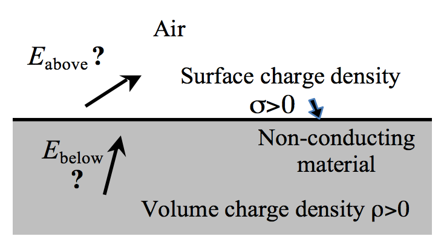
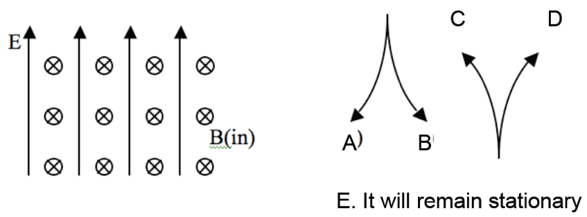

<section data-markdown>

I feel that Exam 2 was a fair assessment.

1. Strongly Agree
2. Agree
3. Neither Agree/Disagree
4. Disagree
5. Strongly Disagree

</section>

<section data-markdown>

I feel that Exam 2 was aligned with what we have been doing (in class and on homework).

1. Strongly Agree
2. Agree
3. Neither Agree/Disagree
4. Disagree
5. Strongly Disagree

</section>

<section data-markdown>

Compared to Exam 1, I felt more prepared for Exam 2.

1. Strongly Agree
2. Agree
3. Neither Agree/Disagree
4. Disagree
5. Strongly Disagree

</section>

<section data-markdown>

## Tutorial
### Boundary Conditions

</section>

<section data-markdown>

## Tutorial Check-in

* When you finish page 1, click A
* When you finish page 2, click B

</section>

<section data-markdown>

## Why are these boundary conditions useful?

</section>

<section data-markdown>

## Magnetostatics

</section>

<section data-markdown>

A proton ($q=+e$) is released from rest in a uniform $\mathbf{E}$ and uniform $\mathbf{B}$.  $\mathbf{E}$ points up, $\mathbf{B}$ points into the page.  Which of the paths will the proton initially follow?

Note:
* CORRECT ANSWER: C
</section>

<section data-markdown>

A + charged particle moving up (speed $v$) enters a region with uniform $\mathbf{B}$ (left) and uniform $\mathbf{E}$ (into page). What's the direction of $\mathbf{F}_{net}$ on the particle, at the instant it enters the region?

1. To the left
2. Into the page
3. Out of the page
4. No net force
5. Not enough information

Note:
* CORRECT ANSWER: E
* The forces point in opposite directions, but not sure of their size
</section>

<section data-markdown>

A proton (speed $v$) enters a region of uniform $\mathbf{B}$. $v$ makes an angle $\theta$ with $\mathbf{B}$. What is the subsequent path of the proton?

1. Helical
2. Straight line
3. Circular motion, $\perp$ to page. (plane of circle is $\perp$ to $\mathbf{B}$)
4. Circular motion, $\perp$ to page. (plane of circle at angle $\theta$ w.r.t. $\mathbf{B}$)
5. Impossible.  $\mathbf{v}$ should always be $\perp$ to $\mathbf{B}$

Note:
* CORRECT ANSWER: A
</section>
