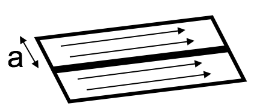
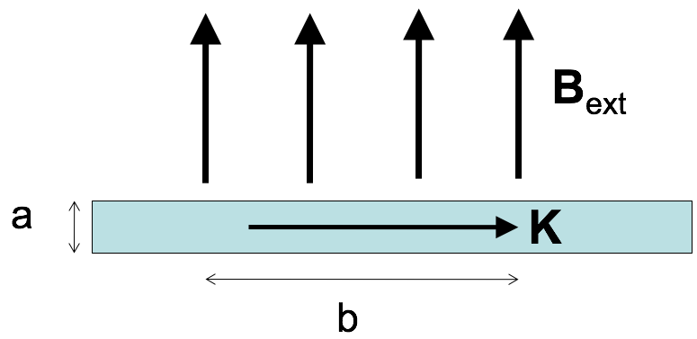
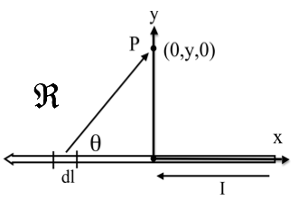
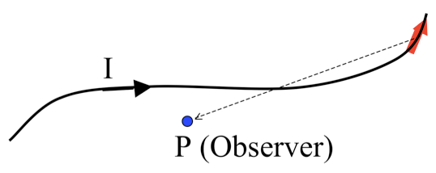
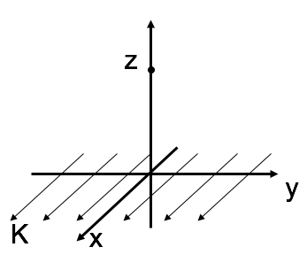

<section data-markdown>

We defined the volume current density in terms of the differential, $\mathbf{J} \equiv \dfrac{d\mathbf{I}}{da_{\perp}}$.

When is it ok to determine the volume current density by taking the ratio of current to cross-sectional area?
$$\mathbf{J} \stackrel{?}{=} \dfrac{\mathbf{I}}{A}$$

1. Never
2. Always
3. $I$ is uniform
4. $I$ is uniform and $A$ is $\perp$ to $I$
5. None of these

Note:
* CORRECT ANSWER: D

</section>

<section data-markdown>

Current $I$ flows down a wire (length $L$) with a square cross section (side $a$). If it is uniformly distributed over the outer surfaces only, what is the magnitude of the surface current density $K$?

1. $K = I/a^2$
2. $K = I/a$
3. $K = I/4a$
4. $K = aI$
5. None of the above

Note:
* CORRECT ANSWER: C

</section>

<section data-markdown>

A "ribbon" (width $a$) of surface current flows (with surface current density $K$). Right next to it is a second identical ribbon of current. Viewed collectively, what is the new total surface current density?

1. $K$
2. $2K$
3. $K/2$
4. Something else

Note:
* CORRECT ANSWER: A

</section>

<section data-markdown>

A "ribbon" (width $a$) with uniform surface current density $K$ passes through a uniform magnetic field $\mathbf{B}_{ext}$. Only the length $b$ along the ribbon is in the field. What is the magnitude of the force on the ribbon?

1. $KB$
2. $aKB$
3. $abKB$
4. $bKB/a$
5. $KB/(ab)$

Note:
* CORRECT ANSWER: C

</section>

<section data-markdown>

Which of the following is a statement of charge conservation?

1. $\dfrac{\partial \rho}{\partial t} = -\nabla \mathbf{J}$
2. $\dfrac{\partial \rho}{\partial t} = -\nabla \cdot \mathbf{J}$
3. $\dfrac{\partial \rho}{\partial t} = -\int \nabla \cdot \mathbf{J} d\tau$
4. $\dfrac{\partial \rho}{\partial t} = -\oint \mathbf{J} \cdot d\mathbf{A}$

Note:
* CORRECT ANSWER: B

</section>

<section data-markdown>

To find the magnetic field $\mathbf{B}$ at P due to a current-carrying wire we use the Biot-Savart law,  
$$\mathbf{B}(\mathbf{r})  = \dfrac{\mu_0}{4\pi}I\int \dfrac{d\mathbf{l}\times\hat{\mathfrak{R}}{\mathfrak{R}^2}$$
In the figure, with $d\mathbf{l}$ shown, which purple vector best represents $\mathfrak{R}$?

Note:
* CORRECT ANSWER: A

</section>

<section data-markdown>

To find the magnetic field $\mathbf{B}$ at P due to a current-carrying wire we use the Biot-Savart law,  
$$\mathbf{B}(\mathbf{r})  = \dfrac{\mu_0}{4\pi}I\int \dfrac{d\mathbf{l}\times\hat{\mathfrak{R}}{\mathfrak{R}^2}$$
What is the direction of the infinitesimal contribution $\mathbf{B}(P)$ created by current in $d\mathbf{l}$?

1. Up the page
2. Directly away from $d\mathbf{l}$ (in the plane of the page)
3. Into the page
4. Out of the page
5. Some other direction

Note:
* CORRECT ANSWER: C

</section>

<section data-markdown>

What is the magnitude of $\dfrac{d\mathbf{l}\times\hat{\mathfrak{R}}{\mathfrak{R}^2}$?

1. $\frac{dl \sin\theta}{\mathfrak{R}^2}$
2. $\frac{dl \sin\theta}{\mathfrak{R}^3}$
3. $\frac{dl \cos\theta}{\mathfrak{R}^2}$
4. $\frac{dl \cos\theta}{\mathfrak{R}^3}$
5. something else!

Note:
* CORRECT ANSWER: A

</section>

<section data-markdown>

What is the value of $I \dfrac{d\mathbf{l} \times \mathfrak{R}}{\mathfrak{R}^2}$?

1. $\frac{I\,y\,dx'}{[(x')^2+y^2]^{3/2}}\hat{z}$
2. $\frac{I\,x'\,dx'}{[(x')^2+y^2]^{3/2}}\hat{y}$
3. $\frac{-I\,x'\,dx'}{[(x')^2+y^2]^{3/2}}\hat{y}$
4. $\frac{-I\,y\,dx'}{[(x')^2+y^2]^{3/2}}\hat{z}$
5. Other!

Note:
* CORRECT ANSWER: D

</section>

<section data-markdown>

What do you expect for direction of $\mathbf{B}(P)$? How about direction of $d\mathbf{B}(P)$ generated JUST by the segment of current $d\mathbf{l}$ in red?

1. $\mathbf{B}(P)$ in plane of page,  ditto for $d\mathbf{B}(P$, by red$)$
2. $\mathbf{B}(P)$ into page,  $d\mathbf{B}(P$, by red$)$ into page
3. $\mathbf{B}(P)$ into page,  $d\mathbf{B}(P$, by red$)$ out of page
4. $\mathbf{B}(P)$ complicated, ditto for $d\mathbf{B}(P$, by red$)$
5. Something else!!

Note:
* CORRECT ANSWER: C
</section>

<section data-markdown>

What is the magnitude of $\dfrac{d\mathbf{l}\times\hat{\mathfrak{R}}{\mathfrak{R}^2}$?

1. $\frac{dl \sin\phi}{z^2}$
2. $\frac{dl}{z^2}$
3. $\frac{dl \sin\phi}{z^2+a^2}$
4. $\frac{dl}{z^2+a^2}$
5. something else!

Note:
* CORRECT ANSWER: D

</section>

<section data-markdown>
What is $d\mathbf{B}_z$ (the contribution to the vertical component of $\mathbf{B}$ from this $d\mathbf{l}$ segment?)

1. $\frac{dl}{z^2+a^2}\frac{a}{\sqrt{z^2+a^2}}$
1. $\frac{dl}{z^2+a^2}$
1. $\frac{dl}{z^2+a^2}\frac{z}{\sqrt{z^2+a^2}}$
1. $\frac{dl \cos \phi}{\sqrt{z^2+a^2}}$
5. Something else!

Note:
* CORRECT ANSWER: A

</section>

<section data-markdown>

I have two very long, parallel wires each carrying a current $I_1$ and $I_2$, respectively.  In which direction is the force on the wire with the current $I_2$?

 1. Up
 2. Down
 3. Right
 4. Left
 5. Into or out of the page

 Note:
 * CORRECT ANSWER: D

</section>

<section data-markdown>

Consider the B-field a distance z from a current sheet (flowing in the +x-direction) in the z = 0 plane. The B-field has:

1. y-component only
2. z-component only
3. y and z-components
4. x, y, and z-components
5. Other

Note:
* CORRECT ANSWER: A

</section>
