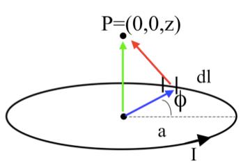

<section data-markdown>

What do you expect for direction of $\mathbf{B}(P)$? How about direction of $d\mathbf{B}(P)$ generated JUST by the segment of current $d\mathbf{l}$ in red?

1. $\mathbf{B}(P)$ in plane of page,  ditto for $d\mathbf{B}(P$, by red$)$
2. $\mathbf{B}(P)$ into page,  $d\mathbf{B}(P$, by red$)$ into page
3. $\mathbf{B}(P)$ into page,  $d\mathbf{B}(P$, by red$)$ out of page
4. $\mathbf{B}(P)$ complicated, ditto for $d\mathbf{B}(P$, by red$)$
5. Something else!!

Note:
* CORRECT ANSWER: C
</section>

<section data-markdown>

What is the magnitude of $\dfrac{d\mathbf{l}\times\hat{\mathfrak{R}}}{\mathfrak{R}^2}$?

1. $\frac{dl \sin\phi}{z^2}$
2. $\frac{dl}{z^2}$
3. $\frac{dl \sin\phi}{z^2+a^2}$
4. $\frac{dl}{z^2+a^2}$
5. something else!

Note:
* CORRECT ANSWER: D

</section>

<section data-markdown>
What is $d\mathbf{B}_z$ (the contribution to the vertical component of $\mathbf{B}$ from this $d\mathbf{l}$ segment?)

1. $\frac{dl}{z^2+a^2}\frac{a}{\sqrt{z^2+a^2}}$
1. $\frac{dl}{z^2+a^2}$
1. $\frac{dl}{z^2+a^2}\frac{z}{\sqrt{z^2+a^2}}$
1. $\frac{dl \cos \phi}{\sqrt{z^2+a^2}}$
5. Something else!

Note:
* CORRECT ANSWER: A

</section>

<section data-markdown>

I have two very long, parallel wires each carrying a current $I_1$ and $I_2$, respectively.  In which direction is the force on the wire with the current $I_2$?

 1. Up
 2. Down
 3. Right
 4. Left
 5. Into or out of the page

 Note:
 * CORRECT ANSWER: D

</section>

<section data-markdown>

Consider the B-field a distance z from a current sheet (flowing in the +x-direction) in the z = 0 plane. The B-field has:

1. y-component only
2. z-component only
3. y and z-components
4. x, y, and z-components
5. Other

Note:
* CORRECT ANSWER: A

</section>
