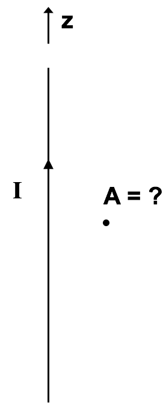

<section data-markdown>

The vector potential A due to a long straight wire with current I along the z-axis is in the direction parallel to:

1. $\hat{z}$
2. $\hat{\phi}$ (azimuthal)
3. $\hat{s}$ (radial)

*Assume the Coulomb Gauge*

Note:
* CORRECT ANSWER: A

</section>

<section data-markdown>

Consider a fat wire with radius $a$ with uniform current $I_0$ that runs along the $+z$-axis. We can compute the vector potential due to this wire directly. What is $\mathbf{J}$?

1. $I_0/(2 \pi)$
2. $I_0/(\pi a^2)$
1. $I_0/(2 \pi a) \hat{z}$
4. $I_0/(\pi a^2) \hat{z}$
5. Something else!?

Note:
* CORRECT ANSWER: D
</section>

<section data-markdown>

Consider a fat wire with radius $a$ with uniform current $I_0$ that runs along the $+z$-axis.
Given $\mathbf{A}(\mathbf{r}) = \dfrac{\mu_0}{4\pi}\int \dfrac{\mathbf{J}(\mathbf{r}')}{\mathfrak{R}}d\tau'$, which components of $\mathbf{A}$ need to be computed?

1. All of them
2. Just $A_x$
3. Just $A_y$
4. Just $A_z$
5. Some combination

Note:
* CORRECT ANSWER: D
</section>

<section data-markdown>

Consider line of charge with uniform charge density, $\lambda = \rho/(\pi a^2)$. What is the magntiude of the electric field outside of the line charge (at a distance $s>a$)?

1. $E = \lambda/(4 \pi \varepsilon_0 s^2)$
1. $E = \lambda/(2 \pi \varepsilon_0 s)$

</section>
