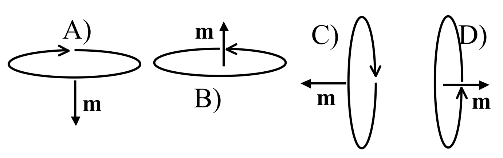

<section data-markdown>

The force on a segment of wire $L$ is $\mathbf{F} = I \mathbf{L} \times \mathbf{B}$ A current-carrying wire loop is in a constant magnetic field $\mathbf{B} = B \hat{z}$ as shown. What is the direction of the torque on the loop?

1. Zero
2. +x
3. +y
4. +z
5. None of these

Note:
* CORRECT ANSWER: B
</section>

<section data-markdown>

The torque on a magnetic dipole in a B field is:

$\mathbf{\tau} = \mathbf{m} \times \mathbf{B}$

How will a small current loop line up if the B field points uniformly up the page?

</section>

<section data-markdown>

Suppose I place a small dipole $\mathbf{M}$ at various locations near the end of a large solenoid. At which point is the magnitude of the force on the dipole greatest?

D) Not enough information to answer

E) There is no net force on a dipole

Recall: $\mathbf{F} = \nabla (\mathbf{m}\cdot\mathbf{B})$

Note:
* CORRECT ANSWER: B

</section>

<section data-markdown>

A small chunk of material (the “tan cube”) is placed above a solenoid. It magnetizes, weakly, as shown by small arrows inside.
What kind of material must the cube be?

1. Dielectric
2. Conductor
3. Diamagnetic
4. Paramagnetic
5. Ferromagnetic

Note:
* CORRECT ANSWER: C

</section>

<section data-markdown>

Predict the results of the following experiment: a paramagnetic bar and a diamagnetic bar are pushed inside of a solenoid.

1. The paramagnet is pushed out, the diamagnet is sucked in
2. The diamagnet is pushed out, the paramagnet is sucked in
3. Both are sucked in, but with different force
4. Both are pushed out, but with different force

Note:
* CORRECT ANSWER: B

</section>
