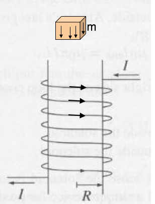

<section data-markdown>

A small chunk of material (the “tan cube”) is placed above a solenoid. It magnetizes, weakly, as shown by small arrows inside.
What kind of material must the cube be?

1. Dielectric
2. Conductor
3. Diamagnetic
4. Paramagnetic
5. Ferromagnetic

Note:
* CORRECT ANSWER: C

</section>

<section data-markdown>

Predict the results of the following experiment: a paramagnetic bar and a diamagnetic bar are pushed inside of a solenoid.

1. The paramagnet is pushed out, the diamagnet is sucked in
2. The diamagnet is pushed out, the paramagnet is sucked in
3. Both are sucked in, but with different force
4. Both are pushed out, but with different force

Note:
* CORRECT ANSWER: B

</section>
