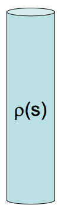

<section data-markdown>

If you put a dielectric in an external field $\mathbf{E}_{x}$
it polarizes, adding a new field,
$\mathbf{E}_{induced}$
(from the bound charges). These superpose, making a total field
$\mathbf{E}_{tot}$
.  What is the vector equation relating these three fields?

1. $\mathbf{E}_{tot} + \mathbf{E}_{ext} + \mathbf{E}_{induced} = 0$
2. $\mathbf{E}_{tot} = \mathbf{E}_{ext} - \mathbf{E}_{induced}$
3. $\mathbf{E}_{tot} = \mathbf{E}_{ext} + \mathbf{E}_{induced}$
4. $\mathbf{E}_{tot} = -\mathbf{E}_{ext} + \mathbf{E}_{induced}$
5. Something else

Note:
* CORRECT ANSWER: C
</section>

<section data-markdown>

We define "Electric Displacement" or "D" field,
$$\mathbf{D} = \varepsilon_0 \mathbf{E} + \mathbf{P}$$

If you put a dielectric in an **external** field, it polarizes, adding a new **induced** field (from the bound charges). These superpose, making a **total** electric field. Which of these three E fields is the "E" in the formula for D above?

1. $\mathbf{E}_{ext}$
2. $\mathbf{E}_{induced}$
3. $\mathbf{E}_{tot}$

Note:
* CORRECT ANSWER: C

</section>

<section data-markdown>

We define $\mathbf{D} = \varepsilon_0 \mathbf{E} + \mathbf{P}$, with

$$\oint \mathbf{D}\cdot d\mathbf{A} = Q_{free}$$

A point charge $+q$ is placed at the center of a dielectric sphere (radius $R$).  There are no other free charges anywhere.  What is $|D(r)|$?

1. $q/(4 \pi r^2)$ everywhere
2. $q/(4 \varepsilon_0\pi r^2)$ everywhere
3. $q/(4 \pi r^2)$ for $r<R$, but ($q/(4 \varepsilon_0\pi r^2)$ for $r>R$
4. None of the above, it's more complicated
5. We need more info to answer!

Note:
* CORRECT ANSWER: A

</section>

<section data-markdown>

A solid non-conducting dielectric rod has been injected ("doped") with a fixed, known charge distribution $\rho(s)$. (The material responds, polarizing internally.)

When computing $D$ in the rod, do you treat this $\rho(s)$ as the "free charges" or "bound charges"?

1. "free charge"
2. "bound charge"
3. Neither of these - $\rho(s)$ is some combination of free and bound
4. Something else.

Note:
* CORRECT ANSWER: A

</section>
