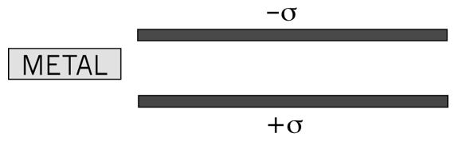
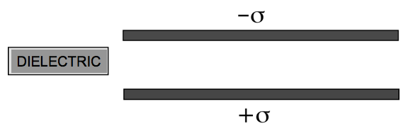

<section data-markdown>
Griffiths argues that the force on a dipole in an E field is:  $\mathbf{F} = \left(\mathbf{p}\cdot\nabla\right)\mathbf{E}$

If the dipole $\mathbf{p}$ points in the $z$ direction, what direction is the force?

1. Also in the $z$ direction
2. perpendicular to $z$
3. it could point in any direction

Note:
* CORRECT ANSWER: C

</section>

<section data-markdown>

Griffiths argues that the force on a dipole in an E field is:  $\mathbf{F} = \left(\mathbf{p}\cdot\nabla\right)\mathbf{E}$

If the dipole p points in the z direction, what can you say about E if I tell you the force is in the x direction?

1. $\mathbf{E}$ simply points in the $x$ direction
2. $E_z$ must depend on $x$
3. $E_z$ must depend on $z$
4. $E_x$ must depend on $x$
5. $E_x$ must depend on $z$

Note:
* CORRECT ANSWER: E

</section>

<section data-markdown>

Are $\rho_b$ and $\sigma_b$ due to real charges?

1. Of course not! They are as fictitious as it gets!
2. Of course they are!  They are as real as it gets!
3. I have no idea  

Note:
* CORRECT ANSWER: B
</section>

<section data-markdown>

If we push this conductor inside the isolated capacitor, will it be drawn into the capacitor or repelled?

1. It gets sucked into the capacitor
2. It gets pushed out from the capacitor
3. I just don’t know.

Note:
* CORRECT ANSWER: A

</section>

<section data-markdown>

If we push this dielectric inside the isolated capacitor, will it be drawn into the capacitor or repelled?

1. It gets sucked into the capacitor
2. It gets pushed out from the capacitor
3. I just don’t know.

Note:
* CORRECT ANSWER: A

</section>
