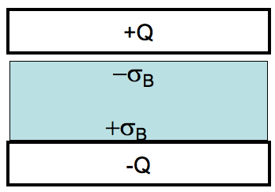
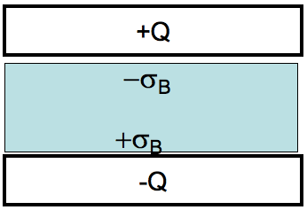
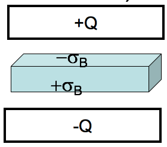
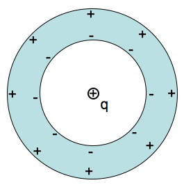
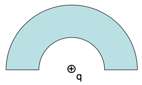
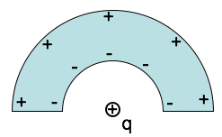

<section data-markdown>
Griffiths argues that the force on a dipole in an E field is:  $\mathbf{F} = \left(\mathbf{p}\cdot\nabla\right)\mathbf{E}$

If the dipole $\mathbf{p}$ points in the $z$ direction, what direction is the force?

1. Also in the $z$ direction
2. perpendicular to $z$
3. it could point in any direction

Note:
* CORRECT ANSWER: C

</section>

<section data-markdown>

Griffiths argues that the force on a dipole in an E field is:  $\mathbf{F} = \left(\mathbf{p}\cdot\nabla\right)\mathbf{E}$

If the dipole p points in the z direction, what can you say about E if I tell you the force is in the x direction?

1. $\mathbf{E}$ simply points in the $x$ direction
2. $E_z$ must depend on $x$
3. $E_z$ must depend on $z$
4. $E_x$ must depend on $x$
5. $E_x$ must depend on $z$

Note:
* CORRECT ANSWER: E

</section>

<section data-markdown>

Are $\rho_b$ and $\sigma_b$ due to real charges?

1. Of course not! They are as fictitious as it gets!
2. Of course they are!  They are as real as it gets!
3. I have no idea  

Note:
* CORRECT ANSWER: B
</section>

<section data-markdown>

If we push this conductor inside the isolated capacitor, will it be drawn into the capacitor or repelled?

1. It gets sucked into the capacitor
2. It gets pushed out from the capacitor
3. I just don’t know.

Note:
* CORRECT ANSWER: A

</section>

<section data-markdown>

If we push this dielectric inside the isolated capacitor, will it be drawn into the capacitor or repelled?

1. It gets sucked into the capacitor
2. It gets pushed out from the capacitor
3. I just don’t know.

Note:
* CORRECT ANSWER: A

</section>

<section data-markdown>

An  ideal (large) capacitor has charge $Q$. A neutral linear dielectric is inserted into the gap (with given dielectric constant)
Now that we have $\mathbf{D}$ in the dielectric, what is $\mathbf{E}$ in that **small gap** above the dielectric?

1. $\mathbf{E} = \mathbf{D} \varepsilon_0 \varepsilon_r$
2. $\mathbf{E} = \mathbf{D}/\varepsilon_0 \varepsilon_r$
3. $\mathbf{E} = \mathbf{D} \varepsilon_0$
4. $\mathbf{E} = \mathbf{D}/\varepsilon_0$
5. Not so simple! Need another method

Note:
* CORRECT ANSWER: D

</section>

<section data-markdown>

An  ideal (large) capacitor has charge $Q$. A neutral linear dielectric is inserted into the gap (with given dielectric constant). Where is $\mathbf{E}$ discontinuous?

i) near the free charges on the plates

ii) near the bound charges on the dielectric surface

1. i only
2. ii only
3. both i and ii (but nowhere else)
4. both i and ii but also other places
5. none of these/something else

Note:
* CORRECT ANSWER: C

</section>

<section data-markdown>

An ideal (large) capacitor has charge $Q$. A neutral linear dielectric is inserted into the gap (with given dielectric constant). Where is $\mathbf{E}$ discontinuous?

i) near the free charges on the plates

ii) near the bound charges on the dielectric surface

1. i only
2. ii only
3. both i and ii (but nowhere else)
4. both i and ii but also other places
5. none of these/something else

Note:
* CORRECT ANSWER: C

</section>

<section data-markdown>

An ideal (large) capacitor has charge $Q$. A neutral linear dielectric is inserted into the gap (with given dielectric constant). Where is $\mathbf{D}$ discontinuous?

i) near the free charges on the plates

ii) near the bound charges on the dielectric surface

1. i only
2. ii only
3. both i and ii (but nowhere else)
4. both i and ii but also other places
5. none of these/something else

Note:
* CORRECT ANSWER: A

</section>

<section data-markdown>

A point charge $+q$ is placed at the center of a neutral, linear, homogeneous, dielectric teflon shell. Can $\mathbf{D}$ be computed from its divergence?

$$\oint \mathbf{D} \cdot d\mathbf{A} = Q_{free}$$

1. Yes
2. No
3. Depends on other things not given

Note:
* CORRECT ANSWER: A

</section>

<section data-markdown>

A point charge $+q$ is placed at the center of a neutral, linear, homogeneous dielectric teflon shell. The shell polarizes due to the point charge. Is the curl of the polarization $\mathbf{P}$ zero everywhere?

$$\oint \mathbf{P} \cdot d\mathbf{l} = 0\;\mathrm{for}\;\mathrm{every}\;\mathrm{loop?}$$

1. Yes
2. No
3. Depends on other things not given

Note:
* CORRECT ANSWER: A
</section>

<section data-markdown>

A point charge $+q$ is placed at the center of a neutral, linear, dielectric **hemispherical** shell. Can $\mathbf{D}$ be computed from its divergence?

$$\oint \mathbf{D} \cdot d\mathbf{A} = Q_{free}$$

1. Yes
2. No
3. Depends on the inner radius of the dielectric

Note:
* CORRECT ANSWER: B

</section>

<section data-markdown>

A point charge $+q$ is placed at the center of a neutral, linear, dielectric shell.  The shell polarizes due to the point charge. Is the curl of the polarization $\mathbf{P}$ zero everywhere?

$$\oint \mathbf{P} \cdot d\mathbf{l} = 0\;\mathrm{for}\;\mathrm{every}\;\mathrm{loop?}$$

1. Yes
2. No
3. Depends on the inner radius of the dielectric.

Note:
* CORRECT ANSWER: B
</section>
